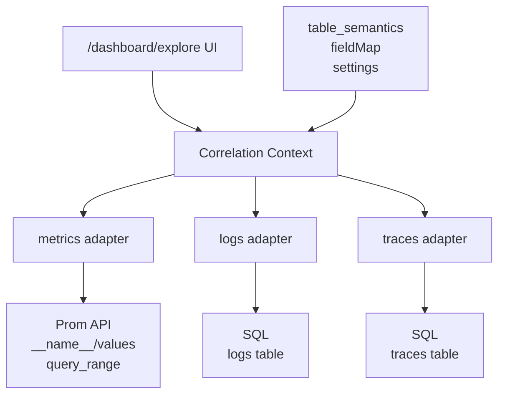

# Context 与 Adapters 架构摘要

> 完整 Context 字段与语义层见 [product master](../plans/01-product-explore-master.plan.md)。  
> Grafana 对照见 [grafana research](../plans/03-grafana-drilldown-research.plan.md)。

---

## 数据流



---

## Context 字段

| 字段 | 用途 |
|------|------|
| `timeRange` | 三信号统一时间窗 |
| `filters[]` | 顶栏 label chips；驱动 Prom `match[]` 与 Logs/Traces WHERE |
| `metric?` | 当前选中 Prom 指标名 |
| `focusTraceId?` | Trace 详情 + Logs 按 trace 过滤 |
| `logsTable` / `tracesTable` | `resolve*` 结果 |
| `fieldMap` | Prom label 名 → 各信号表列名 |

---

## 三 Adapter 职责

### metrics adapter

```text
listMetrics(ctx)     → GET __name__/values (+ match, start, end)
inferPromQL(m, ctx)  → 按 metric.type 生成 PromQL
queryRange(expr, ctx)→ executePromQLRange
breakdownLabels(m)   → GET /labels, /label/{k}/values
relatedMetrics(ctx)  → 全量列表 + Levenshtein 排序
```

### logs adapter

```text
resolveLogsTable()   → settings → signal_type=log → 启发式
logsVolume(ctx)      → GROUP BY service 列（fieldMap）
relatedLogs(ctx)     → 需 filters；SQL WHERE + LIMIT
```

### traces adapter

```text
resolveTracesTable() → greptime_trace_v1 / opentelemetry_traces
listRootSpans(ctx)   → parent_span_id IS NULL + filters
traceDetail(id)      → Gantt（复用现有组件）
```

---

## 初始加载顺序（Greptime）

1. Context 默认 `15m`，空 filters
2. **并行**：`resolveLogsTable` + `resolveTracesTable` + metrics 名列表
3. 有表则 Logs/Traces **可**自动查；Metrics **仅目录**，Select 后才 `query_range`
4. Debounce；per-panel 错误态

---

## 与 Grafana 差异

| | Grafana | Greptime Explore |
|--|---------|------------------|
| 架构 | 三个 Drilldown App + 跳转 | 单页 Context |
| Logs volume | Loki `index/volume` | SQL `GROUP BY` |
| Traces RED | Tempo 派生 | SQL 聚合（Phase 2） |
| Logs 表 | stream label，无需选表 | **必须** `resolveLogsTable` + fieldMap |
