# Greptime Drilldown 产品规划

> **「Explore 计划」= 本文件。** Explore 是 **新 Drilldown 产品** 的内部代号（路由 `/dashboard/explore`），不是现有的 logs-query「Logs Explore」。

## 产品是什么

**参考 Grafana Drilldown 的产品特性**，在 GreptimeDB 上做 **queryless** 的 Metrics / Logs / Traces 下钻——用户点选过滤，不写 PromQL/SQL。

| Grafana 特性 | Greptime 实现要点 |
|--------------|-------------------|
| Metrics：指标列表预筛 → 选 metric → label Breakdown | Prom `__name__/values` + `table_semantics.metric.type` → auto PromQL |
| Logs：service volume → 日志表 → Labels | SQL `GROUP BY` + `resolveLogsTable()`（无 Loki） |
| Traces：RED / 列表 → trace 详情 | SQL 根 span + Gantt |
| 跨信号关联 | **共享 Context**（时间 + label chips + traceId）同屏刷新，而非跳三个 App |

**不做**：Perses 集成；改 logs-query 页面；单独 `/logs-drilldown` 路由。

## 产品边界（已确认）

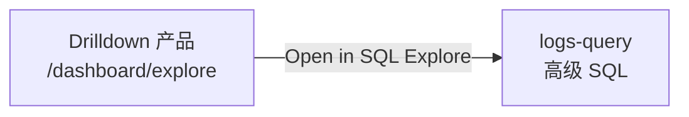

|      | Drilldown 产品（新）                             | [logs-query](src/views/dashboard/logs/query/) |
| ---- | ------------------------------------------------ | --------------------------------------------- |
| 对标 | Grafana Metrics+Logs+Traces Drilldown            | 无对标；纯 SQL 工具                           |
| 用户 | 点选下钻，不写查询                               | SQL Builder / 手写 SQL                        |
| 路由 | `/dashboard/explore`（**一条新路由**）           | `/dashboard/logs-query`（保持）               |

与 **Perses** 无关；独立 metrics/traces 全屏页仅作高级出口。

---

## 已对齐的技术方向（与布局无关，可先实现）

### Correlation Context

单一状态源，三信号区订阅同一对象：

- `timeRange`、`filters[]`（跨信号 label chips）
- `metric?`、`focusTraceId?`
- `logsTable` / `tracesTable`（`resolve*` 结果）
- `fieldMap`（OTEL 列映射）

变更 → adapters 重查，**就地刷新**，不跳 App。

### GreptimeDB 语义层（可读，Explore 表/指标发现的首选）

GreptimeDB v1.1+ 语义层分 **三部分**（官方：[Semantic Layer](https://docs.greptime.com/user-guide/concepts/semantic-layer/)）。Explore 应全部读取，再降级到列名启发式。

> 命名说明：Greptime 官方视图是 **`information_schema.table_semantics`**（`DESC TABLE_SEMANTICS`），不是 `semantic_tables`；飞书/内部文档若写后者，通常指同一视图。

#### 三层语义

| 层级 | 存储 | 查询 | Explore 用途 |
|------|------|------|--------------|
| **表级** | `CREATE TABLE ... WITH('greptime.semantic.*')` | **`information_schema.table_semantics`** | `signal_type` 判 log/trace/metric；`semantic_options` 含 `metric.type`/`unit`/`temporality`/`trace.conventions` |
| **列类型** | 引擎内置 | `information_schema.columns.semantic_type` | `TIMESTAMP`→时间列；`TAG`→label/分组列；`FIELD`→值列 |
| **列说明** | SQL `COMMENT '...'` | `information_schema.columns.column_comment` | 人工表字段语义（如「采样时间」「主机名」）；OTLP 自动建表通常为空 |

**`table_semantics`  promoted 列**：`signal_type`、`source`、`pipeline`、**`metadata_quality`**（`declared`/`inferred`/`unknown`——决定 `metric.type` 是否可信）。

**`semantic_options` JSON 示例**（OTLP metric）：

```json
{
  "metric.original_name": "gen_ai.client.token.usage",
  "metric.type": "histogram",
  "metric.temporality": "cumulative",
  "metric.unit": "{token}"
}
```

**列 comment 示例**（本实例仅 `cpu_metrics_30` 有人工 comment）：

| column | column_comment | semantic_type |
|--------|----------------|---------------|
| `ts` | 采样时间 | TIMESTAMP |
| `host` | 主机名 | FIELD |
| `cpu_usage` | CPU 使用率 0~1 | FIELD |

OTLP 表（`genai_conversations`、`opentelemetry_traces`）当前 **column_comment 为空**，field map 主要靠 **标准 OTEL 列名 + semantic_type**。

#### `buildFieldMap(table)` 优先级（Explore 专用）

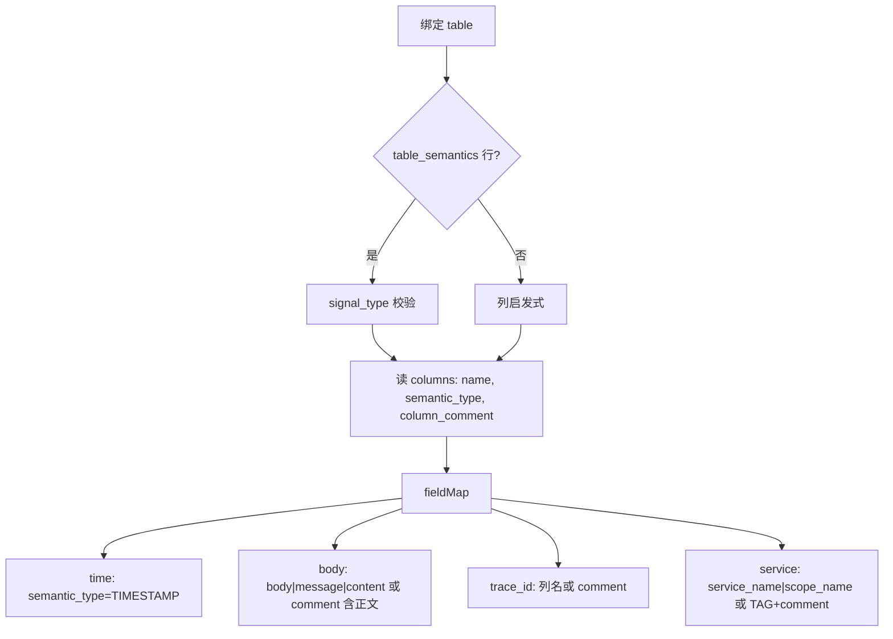

1. **时间**：`semantic_type === 'TIMESTAMP'`（与现 [getTableSchema](src/api/editor.ts) 一致，Explore 需 **追加 `column_comment`**）
2. **正文/级别/trace/service**：OTEL 标准列名优先
3. **comment**：仅作补充（中文描述、非标准列名）；不可单独依赖（覆盖率低）
4. **metric PromQL**：`table_semantics.semantic_options.metric.type` + 看 `metadata_quality === 'declared'`；否则 `_total`/`_bucket` 启发式

#### 覆盖率与降级（重要）

| 统计 | 本实例 |
|------|--------|
| `public` 总表数 | ~483 |
| 有 `table_semantics` 的行 | **10**（8 metric OTLP + 1 log + 1 trace） |
| Prom Remote Write 指标（如 `go_gc_duration_seconds`） | `ENGINE=metric`，**无** `greptime.semantic.*` |

因此 Explore **不能**只依赖 `table_semantics`；必须 **语义层优先 + 启发式降级**：

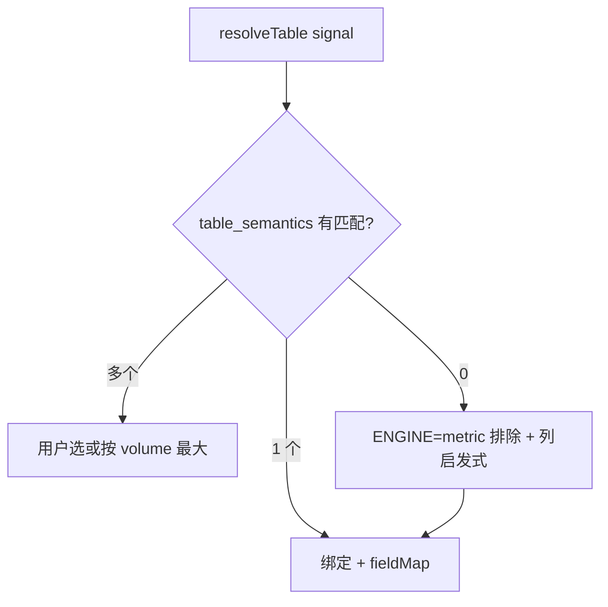

#### Explore 各信号如何用

| 信号 | 表发现 | 指标/字段 |
|------|--------|-----------|
| **Logs** | `WHERE signal_type='log'` → 唯一则绑定 | 列名 OTEL 标准 + `semantic_type` 找 TIMESTAMP/TAG |
| **Traces** | `WHERE signal_type='trace'`；或列含 `trace_id`+`parent_span_id` | `pipeline`/`table_data_model=greptime_trace_v1` 可确认 trace 模型 |
| **Metrics 列表** | Prom `__name__/values`（主路径） | 对已选 metric：若 `table_semantics` 有行 → 读 `semantic_options.metric.type` 生成 PromQL（counter→`rate`）；否则 `_total`/`_bucket` 启发式 |
| **Metrics 过滤 metric 表** | `ENGINE=metric` 或 `signal_type='metric'` | 避免把 metric 物理表当 logs |

#### 实现模块

- `src/observability/table-semantics.ts` — 查 **`table_semantics`**、解析 `semantic_options`、`metadata_quality`
- `src/observability/field-map.ts` — `buildFieldMap()`：columns（**含 `column_comment`**）+ OTEL 别名 + TAG 列作 filters
- `resolveLogsTable()` / `resolveTracesTable()` — 第 3 步 `signal_type`；第 4 步列启发式
- `inferMetricQuery(metricName)` — `table_semantics` → 启发式；尊重 `metadata_quality`
- Explore 扩展 schema 查询：`SELECT column_name, data_type, semantic_type, column_comment FROM information_schema.columns ...`（现 [getTableSchema](src/api/editor.ts) **未查 comment**，仅 Explore 路径需要，不必改 logs-query）

Dashboard **目前未读** `table_semantics` 与 `column_comment`（仅列级 `semantic_type`）；Explore Phase 0 应新增。

---

### `resolveLogsTable()`（Explore 自有，不读 logs-query localStorage）

优先级：URL/Context → Explore 设置 → **`information_schema.table_semantics WHERE signal_type='log'`** → 列启发式（TIMESTAMP + body/message，排除 `ENGINE=metric`）→ 表名 `opentelemetry_logs` / `genai_conversations` 等 → 多候选用户选。

校验：TIMESTAMP 列（`semantic_type=TIMESTAMP` 或 data_type 含 timestamp）+ body/message/content；非 metric 引擎表。

### 各信号行为（落在 Explore 内，非独立 Logs Drilldown 页）

- **Logs**：自动 volume + 表；点 cell → `filters`；`trace_id` → `focusTraceId`
- **Traces**：根 span 列表；`trace_id` → 同区 Gantt
- **Metrics**：见下方 **Metrics Drilldown 专项**

---

## Metrics Drilldown 专项（Grafana 怎么读列表 → Greptime 怎么做）

> 参考：[Grafana Drill down your metrics](https://grafana.com/docs/plugins/grafana-metricsdrilldown-app/latest/drill-down-metrics/)

### Grafana：指标列表怎么来

**首屏不跑全库 `query_range`**。流程是：**先筛指标名目录 → 用户点选单个指标 → 再对该指标 auto PromQL + 小图/详情**。

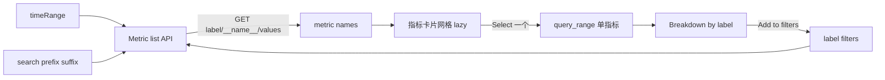

#### 核心 API

| 用途 | Prometheus API |
|------|----------------|
| **指标名列表** | `GET /api/v1/label/__name__/values?limit=N` |
| 带 label 收窄 | 同上 + `match[]={service="checkout",env="prod"}`（多个 filter **AND**） |
| 带时间窗 | 同上 + `start` / `end`（只列该窗内**有 series** 的指标） |
| 名称搜索 | `match[]={__name__=~".*cpu.*"}` 或客户端过滤 |
| Label 键/值（Breakdown、Add filter） | `GET /labels?match[]=...`、`GET /label/{key}/values?match[]=...` |
| 选中后绘图 | `GET /api/v1/query_range`（auto 生成 PromQL） |
| 备选列表 | `GET /api/v1/series?match[]=...&start=&end=` → 对 `__name__` 去重 |

**`__name__` 特殊规则**（[metrics-drilldown#235](https://github.com/grafana/metrics-drilldown/pull/235)）：用户可用 `__name__` filter **缩小列表**，但 **不写入** PromQL（避免 `metric{__name__="metric"}` 重复）。

#### 筛选维度（Grafana Metrics Drilldown）

| 维度 | 位置 | 逻辑 | 作用对象 |
|------|------|------|----------|
| **timeRange** | 顶栏 Time picker | 变更重拉列表 | 指标名 / 卡片小图 |
| **Label filters** | Filters → Add label | 多 filter **AND**；`= / != / =~ / !~` | 列表 + 后续 query |
| **Metric search** | 搜索框 | 关键词 | 指标名 |
| **Sort by** | 下拉 | 默认(最近选中优先)、A-Z、Z-A、Dashboard/Alert 使用频率 | 列表排序 |
| **Prefix filter** | 左侧栏 | 多 prefix **OR**；与其他 filter **AND** | 指标名 |
| **Suffix filter** | 左侧栏 | 多 suffix **OR** | 指标名 |
| **Rules filter** | 左侧栏 | recording rule vs 普通 metric | 指标名 |
| **Recent metrics** | 左侧栏 | 按首次写入时间 | 指标名 |
| **Group by labels** | 左侧栏 | 按 label 值**分组展示**（可视组织） | UI 分组 |
| **Bookmarks** | 左侧栏 | 本地保存 | 用户收藏 |
| **Series limit** | 数据源配置 | 默认 40000 | 列表上限 |

选中指标后的 **Breakdown 维度**：对该 metric 的 **每个 label** → 各 value 一条时序 → 点 value **Add to filters**（层层收窄）。

选中后 **Related metrics**：名称前缀/相似度（客户端），非 Prom API。

---

### 现 dashboard metrics 页（对照）

| 项 | 现状 [metric-sidebar.vue](src/views/dashboard/metrics/components/metric-sidebar.vue) |
|----|----------------------------------------------------------------------------------------|
| 列表 API | `getMetricNames()` → `label/__name__/values`，**无 start/end/match** |
| 搜索 | `searchMetricNames(regex)` → `match[]={__name__=~".*..."}` |
| Label 树 | 展开 metric 才 `getLabelNames` / `getLabelValues`（explorer 用，非 drilldown 列表筛） |
| 时间 | **不参与**列表；仅 query 时用 |
| limit | 500（`METRIC_NAMES_LIMIT`） |
| 选指标后 | 用户手写/点树插入 PromQL，**无 auto query** |

---

### GreptimeDB：Metrics 列表实现方案

#### Phase 1 — 列表（Explore metrics adapter）

**输入**：Correlation Context 的 `timeRange` + `filters[]`（与 Logs/Traces 共享 chips）。

**构建 `match[]` selector**（AND 所有 label chips，**排除 `__name__` 写入 PromQL**）：

```text
filters: service_name=checkout, job=api
→ match[] = {service_name="checkout",job="api"}
search: cpu
→ 追加 __name__=~".*cpu.*"  （仅用于列表 API，不进 query_range matcher）
```

**列表请求（优先级）**：

```text
1. GET /v1/prometheus/api/v1/label/__name__/values
     ?db=...&limit=500
     &start=<unix>&end=<unix>
     &match[]={...}

2. 若 match 不生效或需更准（Greptime 待验证）：
     GET /series?match[]={...}&start=&end= → 去重 __name__

3. Prefix/suffix：客户端 filter（Grafana 侧栏亦大量客户端逻辑）
     name.startsWith("go_") / endsWith("_total")
```

**本实例探测（localhost:4000）**：

| 测试 | 结果 |
|------|------|
| `__name__/values` 无参 | 421 个 metric 名 |
| + `start`/`end`（15m） | 仍 421（可能全库有历史或时间过滤未生效） |
| + `match[]={job=~".+"}` | **未收窄**，仍返回同类列表 |
| `/metadata` | 不可用（404） |
| `group by (__name__)` instant | 语法报错 |

→ **实现时必须先对 Greptime Prom API 做 capability 探测**；`match[]` 不可靠则 fallback **`/series` 去重** 或 **客户端 prefix/suffix + 全量名后再 filter**。

**Sort（MVP）**：

| 选项 | 实现 |
|------|------|
| A-Z / Z-A | 客户端 sort |
| 最近选中 | localStorage `explore-recent-metrics` |
| Dashboard/Alert 频率 | **Phase 2+**（需扫 Perses/告警，非 MVP） |

**懒加载小图**：与 Grafana 一致——列表只出名；**滚入视口或 hover 再 `query_range`**；未选中的 metric **不发 range**。

#### Phase 2 — 选中指标：auto PromQL

**类型来源（优先级）**：

| 优先级 | 来源 |
|--------|------|
| 1 | `table_semantics` WHERE `table_name = <metric>` → `semantic_options.metric.type` + `metadata_quality=declared` |
| 2 | 同 metric 的 `_count`/`_sum`/`_bucket` 兄弟表 semantics |
| 3 | 名称启发式：`_total`→counter，`_bucket`→histogram，`_sum`+`_count`→histogram/summary，默认 gauge |
| 4 | 默认 `avg(metric{matchers})` |

**PromQL 模板（Grafana 对齐）**：

| metric.type | 默认查询 |
|-------------|----------|
| counter | `sum(rate(<name>{matchers}[5m]))` |
| gauge / updown_counter | `avg(<name>{matchers})` |
| histogram | heatmap：`sum(rate(<name>_bucket{matchers}[5m])) by (le)` |
| summary | `avg(<name>{matchers})` 或 quantile 列 |

Greptime **无** `/api/v1/metadata`；OTLP metric 用 **`table_semantics`** 补类型（本实例 8 张 OTLP metric 表有 `declared` type；421 Prom RW 指标无 semantics，靠启发式）。

#### Phase 3 — Breakdown（label 维度）

选中 `go_gc_duration_seconds` 后：

1. `GET /labels?match[]={__name__="go_gc_duration_seconds", ...matchers}`
2. 用户选 label（如 `instance`）→ `GET /label/instance/values?match[]=...`
3. 对每个 value 发 `query_range`（或一次 query + legend 分 series）
4. 点 value → `filters` chip → **重拉指标列表** + 图带 matcher

复用现 [metrics.ts](src/api/metrics.ts) 的 `getLabelNames` / `getLabelValues`；需给 match 传入 **完整 selector**（含 Context filters）。

#### 模块落点

| 文件 | 职责 |
|------|------|
| `src/observability/adapters/metrics.ts` | `listMetrics(ctx)`、`buildMatchSelector(ctx)`、`inferPromQL(metric, ctx)` |
| `src/api/metrics.ts` | 扩展 `getMetricNames({ start, end, match })`；封装 `listMetricNamesFromSeries` fallback |
| `src/observability/table-semantics.ts` | `getMetricSemantics(tableName)` → type/unit/temporality |

#### Metrics MVP 成功标准

- 进入 Explore：指标列表随 **timeRange + label chips** 刷新（能力允许范围内）
- 未选指标：无全库 `query_range`
- 选中指标：auto PromQL 出图；Breakdown 可点 label → chip
- OTLP metric 优先用 `table_semantics.metric.type`；Prom RW 用启发式

---

## 三信号首页数据获取（规格）

以下描述 **Drilldown 产品首屏**各区域如何取数（与 Grafana Drilldown 对齐，Greptime 实现细节写死）。

### 共享：Correlation Context → 三 adapter

进入 `/dashboard/explore` 时初始化 Context，三信号首页 **并行**读 Context：

```ts
{
  timeRange,          // 默认 Last 15m
  filters: [],        // label chips，跨三信号
  metric?: string,
  focusTraceId?: string,
  logsTable?, tracesTable?,
  fieldMap: { logs, traces },
  settings: DrilldownSettings  // 用户设定，见 Logs/Traces
}
```

TopBar 改时间 / 增删 chip → debounce → 三 adapter 各自重查。

---

### 1. Metrics 首页

#### 1.0 SQL vs PromQL：是否所有 metric 都能用 PromQL？

**结论（Drilldown 规划依据）**：

| 类型 | ENGINE | 在 Prom `__name__` 列表？ | PromQL | SQL 直查逻辑表 | Drilldown 主路径 |
|------|--------|---------------------------|--------|----------------|------------------|
| **Prometheus Remote Write** | `metric` | ✓（如 `go_gc_duration_seconds`） | ✓ | ✓（`greptime_timestamp`/`greptime_value` + TAG 列） | **PromQL** |
| **OTLP Metrics** | `metric` | ✓（如 `gen_ai_client_token_usage_count`） | ✓ | ✓ + `table_semantics.metric.type` | **PromQL** |
| **自建时序表**（业务指标） | `mito` 等 | ✗（如 `cpu_metrics_30`） | ✗ | ✓（`RANGE`/`ALIGN`/TQL） | **不在 Metrics Drilldown 目录**；走 SQL 高级页 / Perses |

Greptime **同一套 metrics 数据往往两套入口**（见 [Prometheus 接入](https://docs.greptime.com/user-guide/ingest-data/for-observability/prometheus/)、[TQL](https://docs.greptime.com/reference/sql/tql/)）：

- **PromQL 路径**：`/v1/prometheus/api/v1/*` — 面向 **metric engine 逻辑表**（Remote Write / OTLP metrics 自动建表）
- **SQL 路径**：`SELECT ... FROM <logical_metric_table>` 或 `TQL EVAL(...) promql AS col` — 可 JOIN logs/traces、做关联分析

**Metric Engine 要点**（[Table Engines](https://docs.greptime.com/reference/about-greptimedb-engines/)）：

- 多 **逻辑表**（每个 metric 名一张）共享 **物理表** `greptime_physical_table`
- 查询 PromQL 时走 **逻辑表视角**；SQL 也可查逻辑表或物理宽表
- `SHOW CREATE TABLE go_gc_*` 可见 `ENGINE=metric`, `on_physical_table=greptime_physical_table`

**Drilldown 是否要区分 ENGINE？** — **要**，但用于 **边界**，不是两套 UI：

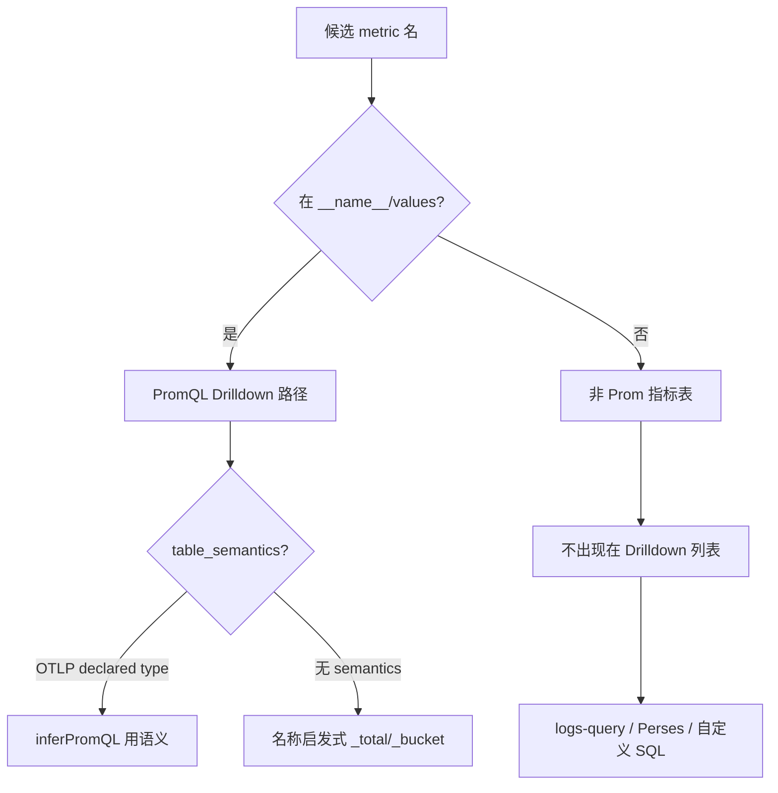

| 用途 | 是否查 `information_schema.tables.engine` |
|------|---------------------------------------------|
| Metrics **列表** | 以 Prom **`__name__/values` 为准**（已隐含 ENGINE=metric 逻辑表） |
| **排除** logs 误选 | `resolveLogsTable` 排除 `ENGINE=metric` |
| **auto PromQL 类型** | 优先 `table_semantics`（OTLP）；Prom RW 无 semantics → 启发式 |
| **SQL 关联**（Phase 2+） | 同一 DB 内 `TQL EVAL + JOIN logs/traces`；非 Drilldown MVP |

**不是**所有 metric 都能 PromQL：只有进入 **Prom 指标目录** 的逻辑表可以。`ENGINE=mito` 的自建表只能 SQL，**不应**出现在 Grafana 式 Metrics Drilldown 名称列表中。

**Hybrid（后续）**：Metrics 面板「Open in SQL」可把当前 metric 逻辑表名 + 时间 + matchers 带到 SQL 编辑器；跨信号关联 MVP 仍用 **Context + PromQL**，Logs/Traces 用 SQL。

#### 1.1 指标名称列表

**目标**：对标 Grafana Metrics Drilldown 首页网格——先有名，再有图；**不对全库 `query_range`**。

**请求链**：

```text
listMetrics(ctx):
  selector = buildMatchSelector(ctx)   // 不含 __name__ 写入 PromQL 的部分单独处理

  ① GET /v1/prometheus/api/v1/label/__name__/values
       ?db=&limit=500
       &start=&end=          // ctx.timeRange → unix
       &match[]={selector}   // label chips AND

  ② 若 Greptime 上 match/start 不生效 → fallback:
       GET /series?match[]={selector}&start=&end= → 去重 __name__

  ③ 客户端再应用（Grafana 侧栏亦大量客户端逻辑）:
       - prefix[] OR
       - suffix[] OR
       - search 关键词（__name__ 子串，大小写 insensitive）
```

**`buildMatchSelector`**：把 `ctx.filters`（除 `__name__`）拼成 `{service_name="x",job="y"}`。  
**`__name__` filter**：仅用于 **缩小列表**；选中 metric 后 PromQL 用 metric 名本身，**不把 `__name__=` 写进 query**（对齐 [metrics-drilldown#235](https://github.com/grafana/metrics-drilldown/pull/235)）。

#### 1.2 排序

| Sort 选项 | 实现 | MVP |
|-----------|------|-----|
| **Default** | 最近选中优先（localStorage `drilldown-recent-metrics`）+ 其余 A-Z | ✓ |
| Alphabetical A-Z / Z-A | 客户端 `localeCompare` | ✓ |
| Dashboard / Alert 使用频率 | 扫 Perses 面板 PromQL / 告警规则 | Phase 2+ |

#### 1.3 前缀 / 后缀 / 分组查看

| 能力 | 行为 | 实现 |
|------|------|------|
| **Prefix filter** | 多 prefix **OR**；与 label filters **AND** | 客户端：`names.filter(n => prefixes.some(p => n.startsWith(p)))` 或 `match[]={__name__=~"^(go\|http)_..."}` |
| **Suffix filter** | 多 suffix **OR** | 同上，`_total`、`_bucket`、`_count` 等 |
| **名称 namespace 分组** | 按 `__name__` 第一段分组展示（如 `go_`、`prometheus_`） | 客户端：`name.split('_')[0]` 或 regex `^([^_]+)` |
| **Group by label** | 按某 label 的值把 metric **卡片分组**（Grafana 左侧栏） | 需先对可见 metrics 抽样 `/series` 或逐 metric 查 label values；**Phase 2**；MVP 仅 prefix 分组 |

**首页展示**：排序 + 分组后的 metric 名列表；滚入视口才 lazy `query_range` 小 sparkline（可选 MVP 省略小图，只显示名）。

#### 1.4 自动选取计算函数（avg / sum(rate) / histogram）

用户 **Select** 一个 metric 后，`inferPromQL(metric, ctx)`：

**类型判定（优先级）**：

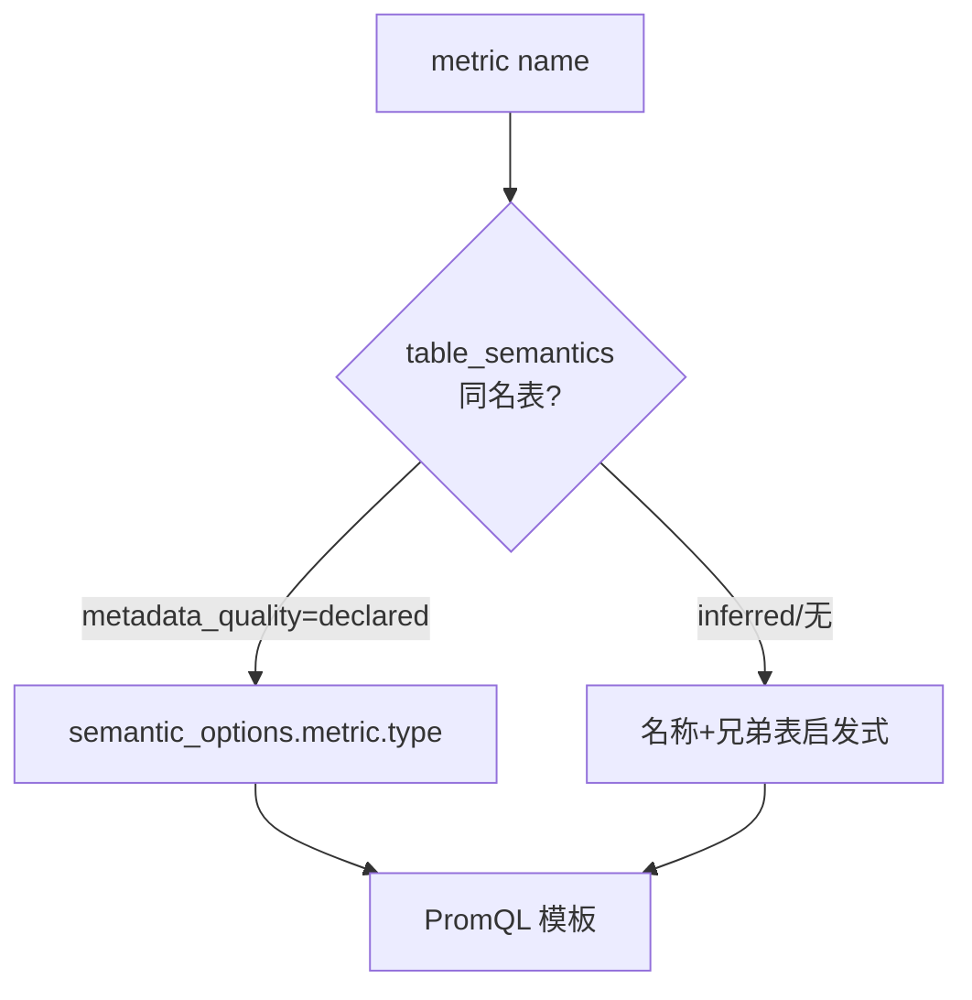

| 优先级 | 来源 | 说明 |
|--------|------|------|
| 1 | `table_semantics` WHERE `table_name = metric` | `semantic_options.metric.type`；`metadata_quality=declared` 最可信 |
| 2 | 同名 `_bucket` / `_sum` / `_count` 兄弟表 semantics | histogram / summary 族 |
| 3 | 名称启发式 | `_bucket`→histogram；`_total`/`*_count`→counter；含 `quantile` label→summary；默认 gauge |
| 4 | 默认 | gauge → `avg` |

**PromQL 模板**（`matchers` = Context label filters，不含 `__name__`）：

| metric.type | 默认表达式 | 可视化 |
|-------------|------------|--------|
| `counter` | `sum(rate(<name>{matchers}[5m]))` | 折线 |
| `updown_counter` | `avg(<name>{matchers})` | 折线 |
| `gauge` | `avg(<name>{matchers})` | 折线 |
| `histogram` | 查 `<name>_bucket` 或自身 bucket 表 → `sum(rate(..._bucket{matchers}[5m])) by (le)` | heatmap |
| `summary` | 有 `quantile` label → `avg(<name>{matchers}) by (quantile)` | 多线 |
| unknown | `avg(<name>{matchers})` | 折线 |

**rate 窗口**：默认 `[5m]`，与 scrape 间隔解耦（Grafana 同类做法）；后续可进设置。

**首页不自动选第一个 metric**——列表预筛后由用户点选（避免盲目打 PromQL）。

---

### 2. Logs 首页

#### 2.1 如何确认 logs 表

Greptime **无 Loki stream**；必须先绑定一张物理 SQL 表。`resolveLogsTable(ctx, settings)`：

| 优先级 | 来源 |
|--------|------|
| 1 | URL `?logsTable=` |
| 2 | **Drilldown 设置** → 默认 logs 表（按 database） |
| 3 | `information_schema.table_semantics` WHERE `signal_type='log'` |
| 4 | 列启发式：`TIMESTAMP` + (`body`\|`message`\|`content`)，且 `ENGINE != metric` |
| 5 | 表名 `opentelemetry_logs` / 已知 OTLP 名若存在 |
| 6 | 多候选 → **设置页或首屏**让用户选；禁止静默选 metric 表 |

**不读** `logs-query` 的 localStorage（`logs-query-table`）。

校验失败 → Logs 区空态 + 引导打开 **设置** 选手动表。

#### 2.2 用户设置：logs 表 + 字段语义

**存储**：`localStorage` key `drilldown-settings`（或 Pinia + URL 同步），结构示例：

```ts
type DrilldownSettings = {
  logs: {
    table?: string                    // 覆盖自动发现
    fieldMap: {
      time: string                    // default: auto
      body: string
      severity?: string
      traceId?: string
      service?: string                // primaryGroupBy 默认列
      primaryGroupBy?: string         // 首页 volume 分组，默认 service_name | scope_name
    }
    jsonPaths?: Record<string, string> // 如 service 在 resource_attributes 内
  }
  traces: {
    table?: string                    // 一般只需覆盖表名；字段跟 greptime_trace_v1 标准
  }
}
```

**设置页 UI**（Drilldown 内，非 logs-query）：

1. 下拉：候选 logs 表（来自 `table_semantics` + 启发式）
2. 选表后：列下拉映射 time / body / severity / trace_id / service
3. 「从 schema 自动填充」：读 `information_schema.columns`（`semantic_type` + `column_comment`）+ OTEL 别名
4. primaryGroupBy：默认 `service_name`，无则 `scope_name`，再无则「All logs」单卡片

#### 2.3 字段语义自动填充（`buildFieldMap`）

| 语义 | 自动识别顺序 |
|------|--------------|
| time | `semantic_type=TIMESTAMP` → 列名 `timestamp`/`ts` |
| body | `body` → `message` → `content` |
| severity | `severity_text` → `level` |
| traceId | `trace_id` |
| service | `service_name` → `scope_name` → settings.jsonPaths |

用户设置 **覆盖** 自动值；写入 Context `fieldMap.logs`。

#### 2.4 首页数据查询（表确认后 **自动执行**）

绑定 `logsTable` + `fieldMap` 后立即查（无需 Run）：

| 元素 | SQL（示意） |
|------|-------------|
| **Volume 时序** | `SELECT date_bin(INTERVAL '1m', <time>), COUNT(*) FROM <table> WHERE <time> BETWEEN ... AND <filters> GROUP BY 1` |
| **按 service 分组卡片**（可选，对标 Grafana 首页） | `GROUP BY date_bin, <primaryGroupBy>`；每卡片 lazy 预览 ~100 行 |
| **日志表** | `SELECT <time>, <severity>, <body>, <traceId> FROM ... ORDER BY <time> DESC LIMIT 100` |

`<filters>`：Context chips → SQL WHERE（列名来自 fieldMap）。

点 cell / label → 写入 Context `filters`；点 `trace_id` → `focusTraceId`。

---

### 3. Traces 首页

#### 3.1 如何确认 traces 表（模型标准优先）

Greptime **有标准 trace 模型** [`greptime_trace_v1`](https://docs.greptime.com/user-guide/traces/data-model/)（OTLP pipeline，默认表 `opentelemetry_traces`）。`resolveTracesTable(ctx, settings)`：

| 优先级 | 来源 |
|--------|------|
| 1 | URL / 设置 `traces.table` |
| 2 | `table_semantics` WHERE `signal_type='trace'`（优先 `pipeline='greptime_trace_v1'`） |
| 3 | 列校验通过：`trace_id` + `parent_span_id` + TIMESTAMP + `span_name`（与现 [traces/index.vue](src/views/dashboard/traces/index.vue) 一致） |
| 4 | 默认表名 `opentelemetry_traces` 若存在 |

**标准模型绑定后**：使用 **固定 field map**（无需用户逐字段配置，除非非标准表）：

| 语义 | greptime_trace_v1 标准列 |
|------|--------------------------|
| time | `timestamp` |
| timeEnd | `timestamp_end` |
| duration | `duration_nano` |
| traceId | `trace_id` |
| spanId | `span_id` |
| parentSpanId | `parent_span_id` |
| service | `service_name`（TAG，PRIMARY KEY 之一） |
| spanName | `span_name` |
| status | `span_status_code` |
| kind | `span_kind` |

`table_semantics.semantic_options.trace.conventions` 可展示 OTEL schema 版本；`pipeline=greptime_trace_v1` 表示走标准布局。

非标准表：降级为列启发式 + 可选设置覆盖（仅 `table` 必填，字段可自动探测）。

#### 3.2 首页数据查询（自动执行）

| 元素 | 条件 | SQL / 行为 |
|------|------|------------|
| **Trace 列表**（默认） | 无 `focusTraceId` | `WHERE parent_span_id IS NULL`（根 span）+ 时间窗 + filters；`ORDER BY timestamp DESC LIMIT N` |
| **Gantt** | 有 `focusTraceId` | `WHERE trace_id = ?` 全 span；复用 [traces/[id].vue](src/views/dashboard/traces/[id].vue) 逻辑 |
| **RED 条/概览**（Phase 2，对标 Traces Drilldown） | 同时间窗 | SQL：`COUNT` spans、`error` ratio（`span_status_code`）、`duration_nano` 分位数 |

列展示默认：`timestamp`, `service_name`, `span_name`, `duration_nano`, `trace_id`, `span_status_code`。

点行 / `trace_id` → `focusTraceId` → 同区 Gantt；点 `service_name` → logs/metrics 共享 filter chip。

#### 3.3 Traces 设置（最小）

相比 Logs，**通常不需字段映射 UI**：

- 设置项：**traces 表名**（下拉，候选来自 `signal_type=trace`）
- 高级：仅非 `greptime_trace_v1` 表时展开字段映射

---

### 4. 三信号首页加载顺序

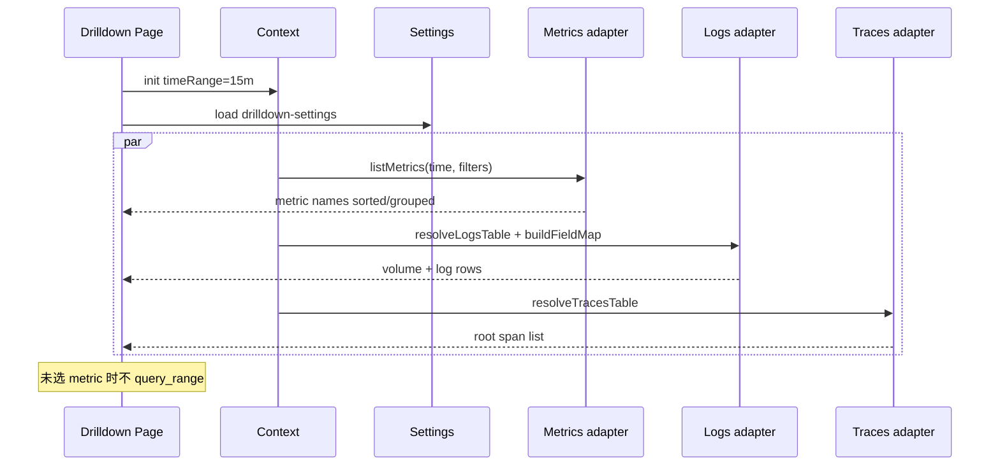

---

### 5. 模块与设置页

| 模块 | 路径 |
|------|------|
| Settings 类型 + persistence | `src/observability/drilldown-settings.ts` |
| Settings UI | `src/views/dashboard/explore/settings.vue` 或 Drawer |
| resolveLogsTable / resolveTracesTable | `src/observability/resolve-table.ts` |
| buildFieldMap | `src/observability/field-map.ts` |
| listMetrics / inferPromQL | `src/observability/adapters/metrics.ts` |
| logs/traces queries | `src/observability/adapters/{logs,traces}.ts` |

---

## 三信号联动：Grafana vs Greptime

> Grafana 参考：[Configure signal correlation](https://grafana.com/docs/grafana-cloud/learn-and-build/telemetry-signals/use-signals-together/setup-correlations/)、[Navigate between signals](https://grafana.com/docs/grafana-cloud/telemetry-signals/use-signals-together/navigation-between-signals/)

### Grafana Drilldown：数据模型上如何关联

Grafana **不做跨库 join**；靠 **约定一致的标识符** + **数据源配置** + **跳转带参**。

| 关联键 | 在各自系统里的形态 | 强度 | 说明 |
|--------|-------------------|------|------|
| **时间** | Prom/Loki/Tempo 各自 time range | 弱 | 跳转时复制时间窗 |
| **共享 labels/attributes** | Metrics/Loki **labels**；Traces **resource/span attributes**（如 `service.name` → `service`） | 中 | **名与值必须完全一致**（大小写敏感） |
| **trace_id** | Logs 字段；Traces 主键；Metrics **exemplar** 附带 | **强** | Logs↔Traces 最可靠 |
| **exemplar** | Histogram/Summary 样本上的 trace_id | 强 | Metrics→Traces 主路径 |
| **自定义 Correlations** | Grafana Configuration → Correlations 规则 | 可配 | 任意 DS 间 rule-based 链接 |

**前提（运维/接入侧）**：

- OTLP 统一接入，`service.name` 等 resource attr 在 metrics labels、log labels、trace attributes 间对齐
- 日志带 `trace_id`（trace context propagation）
- 指标 histogram 开 exemplar（OpenMetrics + `send_exemplars`）
- Tempo DS 配置 Trace→Logs、Trace→Metrics；Loki derived fields 解析 trace_id

**没有 exemplar 时 Metrics→Trace 很弱**；Metrics→Logs 靠 **同名 label 估日志量**，不是精确 join。

---

### Grafana Drilldown：UI 上如何联动

**三个独立 App**（Metrics / Logs / Traces Drilldown），联动 = **换 App + URL/state 带上下文**，不是同屏三块一起变。

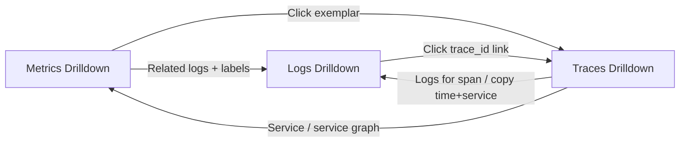

| 方向 | UI 操作 | 带过去的上下文 |
|------|---------|----------------|
| **Metrics → Logs** | 指标详情 **Related logs** Tab；或带 label 跳转 | 时间 + metric 的 labels |
| **Metrics → Traces** | 折线/柱状图上的 **exemplar 菱形** → View trace | trace_id |
| **Logs → Traces** | 日志行 **trace_id** 链接（derived field） | trace_id |
| **Traces → Logs** | Span 上 Logs 链接；或手动 copy 时间 + service 去 Logs | service + 时间窗 |
| **Traces → Metrics** | 服务名 / service graph | service label |
| **任意** | Bookmark / Copy URL | 数据源 + filters + metric + 时间 |

**Metrics 内** Breakdown 点 label → Add filter 只影响 **Metrics App 内** 状态，跨 App 需再点 Related logs 等。

**Investigations**（可选）：把各 Drilldown 面板拖进同一排查视图——仍是先分 App 下钻再拼，不是默认同屏三联。

---

### GreptimeDB：三信号数据模型如何关联

Greptime **同一数据库**存 Metrics / Logs / Traces，但 **物理形态不同**，没有 Grafana 那种跨 DS 配置层：

| 信号 | 存储形态 | 语义标识 |
|------|----------|----------|
| **Metrics** | Prom 兼容 API；每 metric 常对应 `ENGINE=metric` 表；OTLP metric 有 `service_name` 等 **TAG 列** | `table_semantics.signal_type=metric` |
| **Logs** | SQL 表（如 `genai_conversations`） | `signal_type=log`；列 `trace_id`, `scope_name`, `body`… |
| **Traces** | SQL 表 [`greptime_trace_v1`](https://docs.greptime.com/user-guide/traces/data-model/)（默认 `opentelemetry_traces`） | `signal_type=trace`, `pipeline=greptime_trace_v1` |

**同一 OTLP 管线**写入时，天然共享 **trace_id**（本实例已验证 logs ⋈ traces on `trace_id`）：

```sql
-- 强关联：同 trace 的 log 行与 span 行
SELECT l.trace_id, l.scope_name, t.service_name
FROM genai_conversations l
JOIN opentelemetry_traces t ON l.trace_id = t.trace_id
```

**弱/中关联：service 维度不对齐**（需注意 fieldMap）：

| 信号 | 常见「服务」字段 |
|------|------------------|
| Traces | `service_name`（TAG，PK） |
| Logs (OTEL) | `scope_name` 或 `resource_attributes` 内 `service.name` |
| Metrics (OTLP) | `service_name` TAG |
| Metrics (Prom RW) | `job`, `instance`, `app` 等 |

Drilldown **不能假设**三处列名相同；设置里 `fieldMap` + `primaryGroupBy` 做 **语义映射**（如 logs 用 `scope_name`，filters chip 仍展示为 `service`）。

**Metrics→Trace**：Greptime Prom 侧 **exemplar 支持待确认**；MVP **不依赖 exemplar**，Metrics→Trace 走 Logs 点 `trace_id` 或弱 label 对齐。

**Metrics→Logs**：无 Loki stream；用 **共享 label chips** 同时收窄 Prom `match[]` 与 Logs SQL WHERE（映射后的列名）。

---

### Greptime Drilldown：UI 联动设计（相对 Grafana 的差异）

**一个 Context、同屏刷新**（不跳三个 App）：

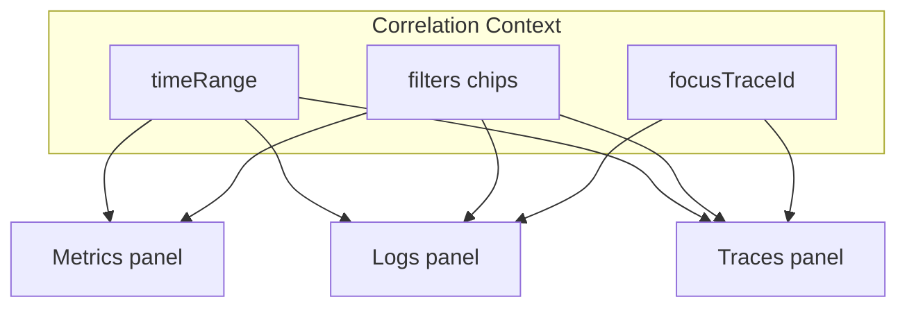

| 级别 | 关联键 | UI 行为 | 三面板数据 |
|------|--------|---------|------------|
| **L1** | 时间 | TopBar / brush | 同一 `[from,to]` 重查 |
| **L2** | labels | 点 Metrics legend、Logs/Traces cell → chip | Prom `match[]` + Logs/Traces SQL WHERE（fieldMap 映射） |
| **L3** | trace_id | 点 Logs/Traces 的 `trace_id` | `focusTraceId`；Traces→Gantt；Logs→`AND trace_id=?`；Metrics **不变**（无 exemplar） |

**对比 Grafana UI**：

| | Grafana Drilldown | Greptime Drilldown |
|--|-------------------|---------------------|
| 布局 | 分 App，跳转 | 同屏三区（布局待定） |
| 状态 | URL / bookmark  per App | 单一 Context + URL sync |
| 强联动 | trace_id、exemplar | trace_id（主）；exemplar Phase 2+ |
| 弱联动 | 共享 label | 共享 chip + fieldMap |
| Related logs | 单独 Tab + 跳 App | Logs 区就地收窄，无跳转 |

**联动时序（用户路径示例）**：

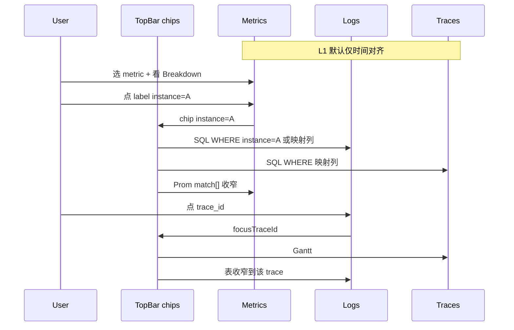

---

### 实现要点（写入 adapters）

| 关联 | Metrics adapter | Logs adapter | Traces adapter |
|------|-----------------|--------------|----------------|
| timeRange | `start`/`end` on list + query_range | `$timestart`/`$timeend` | WHERE timestamp |
| filters[] | Prom label matchers | SQL AND on fieldMap 列 | SQL AND on service_name 等 |
| focusTraceId | 不强制改 query | `AND trace_id = ?` | `WHERE trace_id = ?` → Gantt |
| service 对齐 | `service_name` label | fieldMap.service（可能 scope_name） | `service_name` |

**弱关联提示**：某 signal 缺 filter 对应列时，该面板显示「仅按时间过滤」，不整页空白。

---

## 待定：布局（用户选择「先基建，布局后定」）

| 方案         | 说明                                 | 状态         |
| ------------ | ------------------------------------ | ------------ |
| A 三联同屏   | 上 Metrics，下 Logs \| Traces        | 倾向，未拍板 |
| A+B 混合     | 三联 + Logs 区顶部 service volume 条 | 可选         |
| B Logs 分层  | service 卡片首页再下钻               | 可选         |
| C Tab 主路径 | 分 Tab 切换信号                      | 优先级低     |

**附录 B**（[plan 文件](file:///Users/sun/.cursor/plans/drilldown_ui_planning_733409b9.plan.md)）保留方案 A 首屏草案作参考，**不阻塞 Phase 0**。

---

## 实现落点

| 模块       | 路径                                                               |
| ---------- | ------------------------------------------------------------------ |
| Explore 页 | `src/views/dashboard/explore/`                                     |
| Context    | `src/store/modules/explore` 或 `use-correlation-context.ts`        |
| 表/字段    | `src/observability/resolve-logs-table.ts`、`field-map.ts`          |
| Adapters   | `src/observability/adapters/{metrics,logs,traces}.ts`              |
| 路由       | [dashboard.ts](src/router/routes/modules/dashboard.ts) → `explore` |
| 复用       | `LogTableData`、`count-chart`、Trace Gantt、`TimeRangeSelect`      |

---

## 分阶段执行

**Phase 0（现在可做）**

1. `/dashboard/explore` 最小壳（占位三面板 + TopBar 时间/chips）
2. Context store + URL 同步
3. `resolveLogsTable()` + traces 发现 + field map
4. 三信号 query adapters 读 Context（可先 mock/单面板验证）

**Phase 1（布局定稿后）**

- 按 A / A+B / B 铺正式 UI
- 时间 brush、label chips、traceId 全链路联动
- 空态与错误降级

**Phase 2+**

- Metrics Breakdown、Labels Tab、service volume、深链 logs-query、Explore 设置页

---

## 成功标准

- 一个 Explore 入口、一个 Context
- Logs 表自动绑定，不误选 metric 表
- 布局定稿前：基建可独立验证（改 URL chips → adapter 输出正确 SQL/PromQL）
- 布局定稿后：不写 SQL 完成基本三信号排障；要写 SQL 走 logs-query

---

## Grafana Drilldown：初始加载与关联机制（调研结论）

### 总体架构

Grafana 是 **三个独立 Drilldown App**（Metrics / Logs / Traces），不是默认同屏。跨信号靠 **共享时间 + 同名 label + trace_id/exemplar + 数据源配置**，跳转时把上下文带过去。

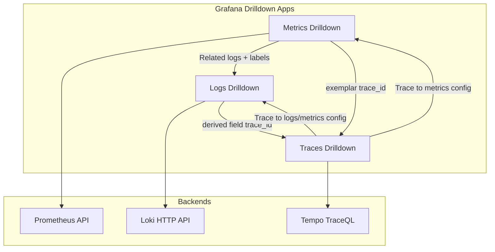

---

### 1. Metrics Drilldown — 初始加载

| 阶段 | 行为 | 后端 API |
|------|------|----------|
| 进入页 | 选 Prometheus 数据源；可选 label filter（sidebar） | 无即时时序查询 |
| 指标目录 | 拉取**可浏览的指标名列表**（非全量 query_range） | `GET /api/v1/label/__name__/values`（可带 `match[]` 按 label 收窄） |
| 高级筛 | prefix/suffix、recording rules、group by labels、书签 | 同上 + 客户端过滤 / 额外 label API |
| 选单个指标 | **自动生成 PromQL**（counter→`rate`、gauge→`avg`、histogram→heatmap） | `GET /api/v1/query_range` |
| Breakdown | 按 label 拆 series，点 value → **Add to filter** | `query_range` + `label/values` |
| Related logs | 用当前 metric 的 labels 估日志量，**跳转** Logs Drilldown | 跨 App，带 labels + time |

要点：**首屏不跑全库 PromQL**；先目录（`__name__` values），用户点选后才 `query_range`。指标网格小图可 **lazy load**。

---

### 2. Logs Drilldown — 初始加载

| 阶段 | 行为 | 后端 API |
|------|------|----------|
| 进入 Overview | 默认时间窗（如 Last 15m） | — |
| Service 列表 | 按 **日志量** 排序展示各 service | `GET /loki/api/v1/index/volume`（`aggregateBy=service` 类语义，默认 limit≈100，可配到 1000） |
| 懒加载 | 仅对**滚入视口**的 service 查 volume 时序 + ~100 行预览 | `query_range` + `query_range`（预览） |
| 时间大变 | **重新拉** service 列表 | 再次 `index/volume` |
| Show logs | 进入 Service 详情，**Logs Tab 自动查** | `query_range`（LogQL stream selector） |
| Labels Tab | 各 label value 的 volume | `index/volume` 或 LogQL aggregation |
| Fields / Patterns | 字段分布、模式 | `patterns` API 等（需 Loki 能力） |

要点：Loki 有 **index/volume** 专用 API；`service_name` 来自 **stream label**，不是用户选表。首页核心是 **按 service 分组的 volume 卡片**。

---

### 3. Traces Drilldown — 初始加载

| 阶段 | 行为 | 后端 API |
|------|------|----------|
| 进入页 | 选 Tempo 数据源 + 时间窗 | — |
| 首屏 | **RED 指标**（Rate / Errors / Duration）由 trace 数据**派生**展示 | Tempo metrics / TraceQL metrics（非用户写 TraceQL） |
| 选主信号 | All spans vs root span；选 Rate/Errors/Duration | 聚合查询 |
| 下钻 | Breakdown 按 attribute；Comparison 对比错误 vs 正常 | TraceQL 或预聚合 |
| Trace 列表 | 过滤后的 trace 列表 | Tempo search / TraceQL |
| Exemplar | Rate/Errors 柱状图上的 **菱形** = 代表 trace | metric sample 附 `trace_id` → 点开 trace drawer |

要点：Traces Drilldown **不靠先写查询**；用 trace 派生的 RED 做入口，再点到具体 trace。

---

### 4. 三信号如何关联（Grafana）

| 关联键 | 方向 | 机制 | 强度 |
|--------|------|------|------|
| **timeRange** | 双向 | 各 App 自己的时间选择器；跳转时 URL/state 传递 | 弱（默认对齐） |
| **labels**（如 `service`） | M↔L、T→M | Prometheus/Loki/Tempo **同名同值** label；Metrics Related logs；Trace to metrics | 中（需配置对齐） |
| **trace_id** | L→T、M→T | Logs derived field；Metrics **exemplar** | 强 |
| **Trace to logs** | T→L | Tempo 数据源设置：span attr → Loki label 映射 | 中（需配置） |
| **自定义** | 任意 | Configuration > Correlations 规则 | 可配 |

**不是**数据库 join：是 **约定 label 一致** + **跳转带参** + **可选数据源关联配置**。无 exemplar 时 Metrics→Trace 很弱。

---

## GreptimeDB 需要如何做（对照 Grafana）

### 与 Grafana 的根本差异

| | Grafana | GreptimeDB |
|--|---------|------------|
| Metrics | Prometheus 兼容 API | 同左；每 metric 可为 `ENGINE=metric` 表 |
| Logs | Loki streams + `index/volume` | **无 Loki**；OTLP 写入 **SQL 表**（如 `opentelemetry_logs`） |
| Traces | Tempo + TraceQL + RED 派生 | **SQL trace 表**（`trace_id`/`parent_span_id`） |
| 语义层 | 各系统自带 | 部分表有 `table_semantics`（`signal_type`）；大量 Prom metric **无** 语义 |
| 跨信号 | 配置 + 跳转 | 需 **Correlation Context** 同屏刷新（我们的目标） |

### 各信号初始加载（Greptime 实现方案）

#### Metrics

| Grafana | Greptime 做法 |
|---------|----------------|
| `__name__/values` + optional `match[]` | 已有 [metrics.ts](src/api/metrics.ts) `getMetricNames`；**需加** `start`/`end`/`match[]` 按时间窗+filters 预筛 |
| 选指标后 auto PromQL | `table_semantics` → 启发式（`_total`→counter）→ 默认 gauge；生成 `sum(rate(...))` 等 |
| Breakdown by label | `getLabelValues` + `query_range` with `by (label)` |
| 首屏不 query_range 全库 | Explore：**列表预筛**，未选 metric 不发 range 查询（与现 metrics 页不同——现页需 URL 有 promql 才查） |

#### Logs

| Grafana | Greptime 做法 |
|---------|----------------|
| `index/volume` by service | **无等价 API** → SQL：`GROUP BY date_bin(...), service_name` on `resolveLogsTable()` |
| 自动知悉 logs 表 | **`resolveLogsTable()`**：URL → 设置 → `table_semantics` → 列启发式 → 用户选 |
| Service 首页卡片 | SQL volume by `primaryGroupBy`（默认 `service_name`/`scope_name`）；懒加载预览行 |
| 详情 Logs 表 | `SELECT ... WHERE ts IN range AND filters ORDER BY ts DESC LIMIT N` |
| Labels breakdown | `GROUP BY` 各 TAG 列 volume（或 JSON path） |

#### Traces

| Grafana | Greptime 做法 |
|---------|----------------|
| RED from Tempo | **SQL 聚合**：`COUNT` rate、`error status` ratio、`duration` percentiles on trace 表 |
| Root span 列表 | `WHERE parent_span_id IS NULL` + time + filters（与现 [traces/index.vue](src/views/dashboard/traces/index.vue) 一致） |
| 单 trace Gantt | `WHERE trace_id = ?`（复用 [traces/[id].vue](src/views/dashboard/traces/[id].vue)） |
| Exemplar | **Phase 2+**（需 metric 样本带 trace_id；Greptime 未必有） |

### 关联实现（Greptime Explore）

用 **单一 Correlation Context** 替代 Grafana 的跨 App 跳转：

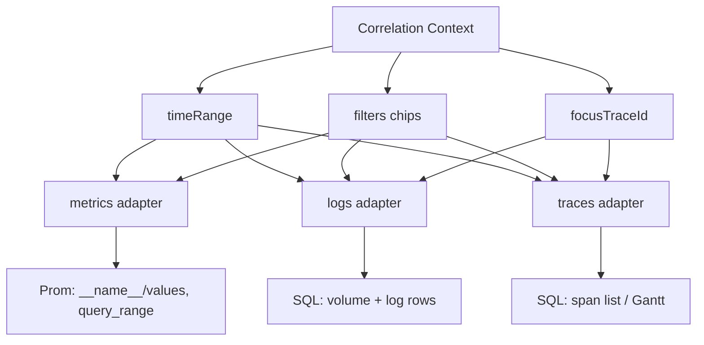

| 关联 | 实现 |
|------|------|
| 时间 | TopBar 唯一 `timeRange`；brush → 更新 Context → 三 adapter 重查 |
| Labels | chip → Prom `match[]` + Logs/Traces SQL `WHERE col = ?`（**field map** 映射列名） |
| trace_id | chip / 点击 → `focusTraceId` → Traces Gantt + Logs `AND trace_id = ?` |
| Metrics→Trace | 无 exemplar：**不强制**改 Metrics；靠用户从 Logs 点 trace_id |
| 表发现 | `resolveLogsTable()` / traces 表发现（`trace_id`+`parent_span_id`）；**不用** logs-query localStorage |

### 建议默认首屏加载顺序（Explore Phase 0/1）

1. 解析 Context 默认值：`timeRange=15m`，`filters=[]`
2. 并行：`resolveLogsTable()` + `resolveTracesTable()` + metrics 名列表（带 start/end）
3. 有 logs 表 → 自动 SQL volume + 最近 N 行
4. 有 traces 表 → 自动 SQL 根 span 列表
5. metrics **仅列表**，用户选指标后再 `query_range`
6. 全部 debounce，共享 loading/error  per panel

### 现 codebase 差距（需新建，非改旧页）

| 能力 | 现状态 | Drilldown 需要 |
|------|--------|----------------|
| 跨信号 Context | 无 | 新建 store + URL sync |
| Metrics 时间预筛列表 | `getMetricNames` 无 start/end | 扩展 API |
| Logs 自动查 | logs-query 有，但用户选表+SQL | Explore adapter + `resolveLogsTable` |
| Traces 自动查 | traces 页有 | 接入 Context |
| trace_id 联动 | 仅 traces 列表→详情页跳转 | 同页 Gantt + Logs 过滤 |
| Loki volume | 无 | SQL `GROUP BY` 替代 |

