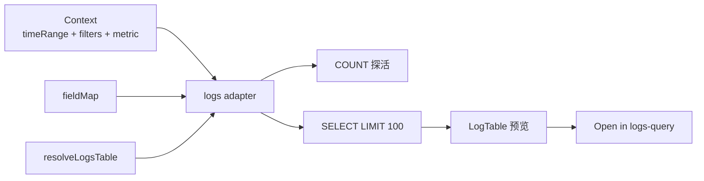
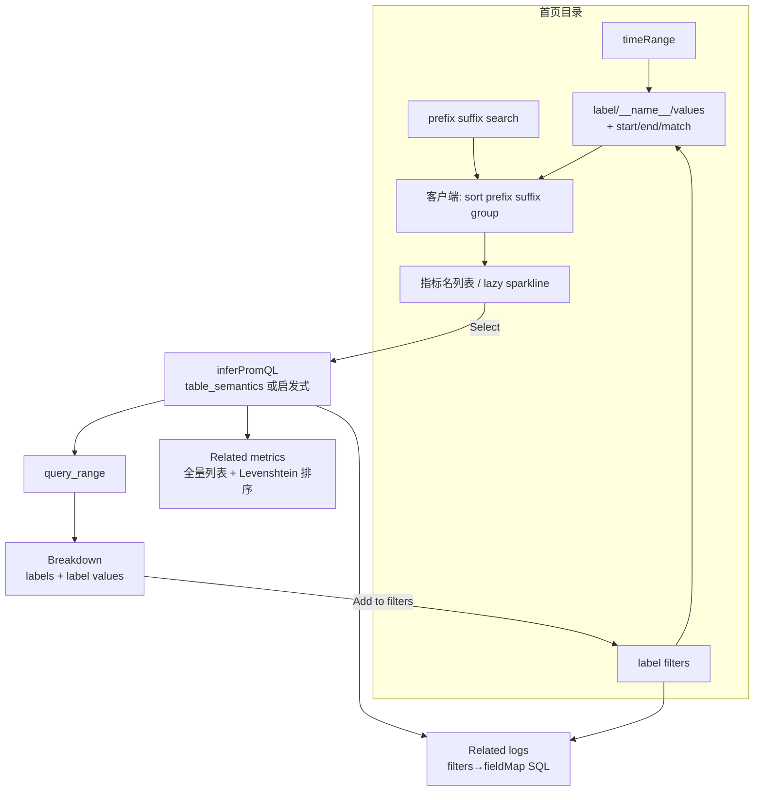

# Grafana Metrics Drilldown 功能清单与 Greptime 取数对照

> 本计划**只覆盖 Metrics Drilldown**，不展开 Logs/Traces Drilldown。产品总规划仍见 [explore_drilldown_unified](file:///Users/sun/.cursor/plans/explore_drilldown_unified_83100fe3.plan.md)。
>
> **与 Logs 规则对照、公共实现模块**：见 [metrics-vs-logs-drilldown-rules.md](../architecture/metrics-vs-logs-drilldown-rules.md)。
>
> Grafana 参考：[Metrics Drilldown](https://grafana.com/docs/grafana/latest/visualizations/simplified-exploration/metrics/)、[Drill down your metrics](https://grafana.com/docs/plugins/grafana-metricsdrilldown-app/latest/drill-down-metrics/)、[metrics-drilldown 仓库](https://github.com/grafana/metrics-drilldown)

---

## 产品心智（一句话）

Grafana Metrics Drilldown = **queryless**：UI 点选生成 PromQL，用户不写查询。流程固定为：

```text
筛指标目录 → 指标卡片网格 → Select 单指标
  → Breakdown：Select label → 看 label values → Add to filters
  → Related metrics：相似名排序列表 → 再 Select 换指标
  → Related logs / Add filter 层层下钻
```

Greptime Dashboard 对标时：**列表只认 Prom `__name__/values`（ENGINE=metric 逻辑表）**；`ENGINE=mito` 自建表不进目录。

---

## 功能总表（Grafana → Greptime 取数）

### A. 首页：指标目录与筛选

| #   | Grafana 功能        | 用户看到什么                                                       | Greptime Dashboard 如何取数                                                                                                   | 现状 / 缺口                                                                      |
| --- | ------------------- | ------------------------------------------------------------------ | ----------------------------------------------------------------------------------------------------------------------------- | -------------------------------------------------------------------------------- |
| A1  | **指标名列表**      | 可浏览的 metric 名（网格/列表）                                    | `GET /v1/prometheus/api/v1/label/__name__/values?db=&limit=500`；可选 `&start=&end=` 限时间窗                                 | [metrics.ts](src/api/metrics.ts) `getMetricNames` **已有**，但**未传** start/end |
| A2  | **Label filters**   | Add label：键 + `=`/`!=`/`=~`/`!~` + 值；多 filter **AND**         | 列表：`__name__/values?match[]={svc="x",env="y"}`；绘图：PromQL 带同一 matcher。`__name__` filter **只筛列表，不写进 PromQL** | `searchMetricNames` 仅支持 `__name__` regex；**缺**通用 match[] + start/end      |
| A3  | **Metric search**   | 搜索框按名关键词                                                   | `match[]={__name__=~".*keyword.*"}` 或客户端 filter                                                                           | `searchMetricNames` **已有**                                                     |
| A4  | **Time picker**     | 相对/绝对时间；改时间重拉列表与图                                  | Context `timeRange` → unix `start`/`end` 传给 label API 与 `query_range`                                                      | metrics 页时间只用于 query，**不驱动列表**                                       |
| A5  | **Refresh**         | Off / 自动刷新                                                     | 定时器重调 list + 当前 `query_range`                                                                                          | 可复用现有 time-range 习惯                                                       |
| A6  | **Sort by**         | Default（最近选中优先）、A-Z、Z-A、Dashboard Usage、Alerting Usage | **客户端 sort**；最近选中 → localStorage；Dashboard/Alert 频率需扫 Perses/告警 → **Phase 2+**                                 | 无                                                                               |
| A7  | **Prefix filter**   | 多 prefix **OR**，与其它 **AND**                                   | 客户端 `startsWith`，或 `match[]={__name__=~"^(go\|http)_.*"}`                                                                | 无                                                                               |
| A8  | **Suffix filter**   | 多 suffix **OR**                                                   | 客户端 `endsWith`（`_total`/`_bucket` 等）                                                                                    | 无                                                                               |
| A9  | **Rules filter**    | recording rule vs 普通 metric                                      | Greptime **无** Prometheus rules 元数据 API → **暂不支持**或 Phase 2+ 启发式（名含 `:`）                                      | 无                                                                               |
| A10 | **Recent metrics**  | 按首次写入时间筛                                                   | 无直接 API；可选查物理表 / 启发式 → **Phase 2+** 或跳过                                                                       | 无                                                                               |
| A11 | **Group by labels** | 按某 label 值把卡片分组展示                                        | 对可见 metrics 抽样 `/series` 或 `/label/{k}/values` → **Phase 2**；MVP 可用 `__name__` 第一段作 namespace 分组（纯客户端）   | 无                                                                               |
| A12 | **Bookmarks** | 侧栏收藏当前状态 | localStorage（db + filters + metric + time） | 无 |
| A12b | **Saved queries**（较新） | Save/Load 整次探索（filters + 状态 + 标题） | Enterprise/Cloud 服务端；OSS **浏览器 localStorage** | 无 |
| A13 | **Series limit** | 高基数时列表不全（Grafana DS 默认 40k） | Greptime 侧 `limit=500`（`METRIC_NAMES_LIMIT`）；搜索收窄；必要时提高 limit | 已有 500 cap |

---

### 「定制 metrics 列表」：Grafana 实际有什么、没有什么

**没有**：管理员配置一份「只显示这些 metric 名」的白名单，用来**替代**全库 `__name__/values` 目录（官方文档无此能力）。

**有**（可视为「保留 / 定制」的几种形态）：

| 能力 | 存什么 | 是否等于「定制列表」 | Greptime 建议 |
|------|--------|----------------------|---------------|
| **Bookmarks** | 单次探索状态：数据源、filters、**已选 metric**、breakdown、时间 | 侧栏 **收藏多个 metric 入口**；点书签直达该 metric 详情 | Phase 2：`localStorage` + 侧栏；存 `{metric, filters, timeRange}` |
| **Saved queries** | 同上 + 用户标题/描述；可 Load 恢复 | 保存的是 **筛选条件 + 状态**，不是静态 metric 名列表 | 可选：与 Bookmark 合并为「已存探索」 |
| **Default sort** | 最近选中的 metric 排前 | **软定制**：`recent-metrics` localStorage | MVP 即可做 |
| **Prefix / Suffix filter** | 当前会话的命名空间规则 | **动态收窄**目录，非持久列表（除非 Bookmark 里带上） | MVP 客户端 filter |
| **Dashboard / Alert Usage sort** | 从已有看板/告警 PromQL 统计出现频率 | **派生列表**，非用户手写名单 | Phase 2+ 扫 Perses |
| **Copy URL** | 完整 URL 状态 | 分享用，非列表 | URL sync |

结论：**可以对标 Grafana 保留「常用 metric」**，靠 **Bookmarks + 最近选中 + prefix 规则**；若 Greptime 需要更强能力，可在 **Drilldown 设置** 增加 `pinnedMetrics: string[]`（用户固定关注的 metric 名，首页置顶或仅显示子集）——这是 **超出 Grafana 的增强**，非必须。

**Greptime 取数（定制列表展示时）**：

```text
全量目录：仍 GET __name__/values（权威来源）
置顶/书签：客户端把 pinnedMetrics ∪ bookmarks.metric 插到列表前
仅看子集（若设置 allowList）：对全量结果 filter name ∈ allowList，或跳过全量直接对 allowList 项逐个校验存在（query_range 探活）
```

---

```http
GET /v1/prometheus/api/v1/label/__name__/values
  ?db=greptime-public
  &limit=500
  &start=<unix>
  &end=<unix>
  &match[]={service_name="checkout"}
```

**Fallback**（若 Greptime 上 `match[]`/`start` 不收窄）：`GET /series?match[]=...&start=&end=` → 对 `__name__` 去重；再客户端 prefix/suffix。实现前做 capability 探测。

---

### B. 首页：指标卡片与选中

| #   | Grafana 功能          | 用户看到什么                     | Greptime 取数                                  | 现状 / 缺口                     |
| --- | --------------------- | -------------------------------- | ---------------------------------------------- | ------------------------------- |
| B1  | **Overview 小图网格** | 每 metric 一张 sparkline（lazy） | 滚入视口才 `query_range`；未选中不打全库       | metrics 页无网格，需手写 PromQL |
| B2  | **Select metric**     | 进入单指标详情                   | 写入 Context `metric=<name>`；触发 auto PromQL | 无                              |
| B3  | **不自动选第一项**    | 避免盲目 query                   | 列表预筛后等用户点选                           | —                               |

---

### C. 单指标：自动查询与可视化

| #   | Grafana 功能            | 用户看到什么                       | Greptime 取数                                                              | 现状 / 缺口                  |
| --- | ----------------------- | ---------------------------------- | -------------------------------------------------------------------------- | ---------------------------- |
| C1  | **Auto PromQL**         | 按类型自动生成查询                 | `inferPromQL(name, matchers)`（见下表）                                    | 无；用户手写                 |
| C2  | **Auto visualization**  | counter 折线、histogram heatmap 等 | 按 `metric.type` 选图组件（折线 / heatmap）                                | 仅通用折线                   |
| C3  | **主图 query_range**    | 时间序列                           | `GET .../query_range?query=&start=&end=&step=` → 已有 `executePromQLRange` | 已有                         |
| C4  | **Query results Tab**   | 原始结果表                         | 同一 PromQL 的 instant `query` 或 range 表格化                             | metrics 有 table tab，可复用 |
| C5  | **Open in Explore**     | 跳转带 PromQL                      | 深链现有 [metrics-query](src/views/dashboard/metrics/) URL `?promql=...`   | 可做                         |
| C6  | **Copy URL / Bookmark** | 分享状态                           | URL sync：time、filters、metric、breakdown label                           | 部分 URL sync 已有，需扩展   |

**Auto PromQL 类型判定（Greptime 无 `/metadata`）**：

| 优先级 | 来源                                        | 用法                                                         |
| ------ | ------------------------------------------- | ------------------------------------------------------------ |
| 1      | `information_schema.table_semantics` 同名表 | `semantic_options.metric.type` + `metadata_quality=declared` |
| 2      | 兄弟表 `_bucket`/`_sum`/`_count`            | histogram / summary 族                                       |
| 3      | 名称启发式                                  | `_bucket`→histogram；`_total`/`*_count`→counter；默认 gauge  |

| metric.type            | 默认 PromQL                                      | 图      |
| ---------------------- | ------------------------------------------------ | ------- |
| counter                | `sum(rate(<name>{matchers}[5m]))`                | 折线    |
| gauge / updown_counter | `avg(<name>{matchers})`                          | 折线    |
| histogram              | `sum(rate(<name>_bucket{matchers}[5m])) by (le)` | heatmap |
| summary                | `avg(<name>{matchers}) by (quantile)`            | 多线    |
| unknown                | `avg(<name>{matchers})`                          | 折线    |

`matchers` = Context label filters（**不含** `__name__=`）。

---

### D. 单指标：Breakdown（层层 label）

| #   | Grafana 功能       | 用户看到什么                     | Greptime 取数                                                             | 现状 / 缺口                      |
| --- | ------------------ | -------------------------------- | ------------------------------------------------------------------------- | -------------------------------- |
| D1  | **Label 列表**     | 该 metric 有哪些 label           | `GET /labels?match[]={__name__="m",...}` → `getLabelNames`                | sidebar 展开已有，未接 Drilldown |
| D2  | **按 label 拆分**  | 选一个 label → 各 value 一条时序 | PromQL：`sum by (<label>) (rate(...))` 或对每个 value 带 matcher 的 range | 无                               |
| D3  | **Label values**   | 某 label 的值列表                | `GET /label/{name}/values?match[]=...` → `getLabelValues`                 | 已有                             |
| D4  | **Add to filters** | 点 value → 加入顶栏 filter 栈    | 写入 Context `filters` → **重拉列表 + 重画主图**                          | 无共享 Context                   |

这是 Metrics **内部**主下钻路径（非跨信号）。**Select 按钮分场景规则**见下节。

---

## Select 按钮规则（Grafana 源码对照）

> 源码：[SelectAction](https://github.com/grafana/metrics-drilldown/blob/main/src/shared/GmdVizPanel/components/SelectAction.tsx)、[MetricLabelsList](https://github.com/grafana/metrics-drilldown/blob/main/src/MetricScene/Breakdown/MetricLabelsList/MetricLabelsList.tsx)、[MetricLabelValuesList](https://github.com/grafana/metrics-drilldown/blob/main/src/MetricScene/Breakdown/MetricLabelValuesList/MetricLabelValuesList.tsx)

**同一 UI 里「Select」有三种不同含义，不要混成一个按钮：**

| 按钮文案 | 组件 | 出现位置 | 点击效果 |
| -------- | ---- | -------- | -------- |
| **Select** | `SelectAction` | 指标卡片网格 | 选中 **metric** → 进入单指标详情 |
| **Select** | `SelectLabelAction` | Breakdown 的 **label** 卡 | 选中 **label** → 进入该 label 的 value 列表 |
| **Add to filters** | `AddToFiltersGraphAction` | Breakdown 的 **value** 卡 | 把 `label=value` 写入顶栏 filter 栈 |

### 下钻三层（用户心智）

```text
1. Select metric  → 顶部主图 + Breakdown Tab 列出各 label（每 label 一张「按该 label 分组」的预览图）
2. Select label   → 该 label 下每个 value 一张图（仅当 label 卡有多条 series 时显示 Select）
3. Add to filters → 把某个 value 写入顶栏 filters，收窄全局探索范围
```

### 何时显示 / 隐藏

| 视图 | 按钮 | 规则 |
| ---- | ---- | ---- |
| 首页指标网格 | **Select**（选 metric） | **始终有**（`MetricsList`、`Related metrics` Tab 复用同一列表组件） |
| Group by labels 组内 metric 卡 | **Select**（选 metric） | **始终有** |
| Group by labels **分组行头** | **Select**（加 filter） | **始终有**；作用是把 `labelName=labelValue` 加入顶栏 filters，**不是**选 metric |
| 已选 metric **顶部主图** | 无 Select | 换 metric 用 action bar **「Select new metric」** 或浏览器返回 |
| Breakdown **label** 卡 | **Select**（选 label） | 默认有；**隐藏**当：该 label 在当前 filters 下查询结果 **只有 1 条 series**（`series.length === 1`）；或 **embeddedMini** 预览模式 |
| Breakdown **value** 卡 | **Add to filters** | 有数据且可过滤时显示；**无按钮**当：数据点 **< 2**（整卡不渲染）；value 为 `<unspecified>`；或 **binary ratio** 查询 |
| embeddedMini（Assistant 等） | 无 header action | 整卡可点击跳转完整 Metrics Drilldown |

### Greptime 对标实现要点

- **分场景挂 action**，不要全局统一一个 Select。
- Breakdown label 卡：查询返回后若 `series.length === 1` → 隐藏 Select。
- Breakdown value 卡：用 **Add to filter** 写 Context `filters[]`，触发列表 + 主图重拉。
- 主图区不提供 Select；提供 **换指标** 入口即可。

---

## Related metrics 加载条件（Grafana 源码对照）

> 源码：[RelatedMetricsScene](https://github.com/grafana/metrics-drilldown/blob/main/src/MetricScene/RelatedMetrics/RelatedMetricsScene.tsx)、[sortRelatedMetrics](https://github.com/grafana/metrics-drilldown/blob/main/src/MetricScene/RelatedMetrics/sortRelatedMetrics.ts)

**核心：Related metrics 不是「按前缀硬过滤」，而是「在全局指标池里按名字相似度排序」。**

### 1. 指标池（哪些 metric 会出现在列表里）

进入 Related Tab 时调用 `fetchAllMetrics()`，等价 PromQL 变量：

```promql
label_values({<当前顶栏 label filters>}, __name__)
```

| 条件 | 是否影响 Related 列表 |
| ---- | --------------------- |
| 顶栏 **Adhoc label filters** | ✓ AND |
| **时间范围** | ✓（随 time picker 刷新） |
| **数据源 / db** | ✓ |
| **当前选中的 metric** | ✗ **不排除**（自己也在列表里，相似度 0，通常排最前） |
| 首页侧栏 **prefix / suffix** | ✗ **不会**自动带进 Related Tab |

### 2. 「Related」怎么算（排序，非默认过滤）

加载完列表后，`sortRelatedMetrics(list, currentMetric)`：

- 用 **Levenshtein 编辑距离** 比较 metric 名与当前选中 metric
- 同时算 **整串距离** + **名字前半段**（按 `_` 切分）距离
- **距离越小 → 越靠前**

官方文档 *「similar names and common prefixes」* 在实现上是 **相似度排序**；同 prefix 的 metric 自然更靠前，但 **默认展示全库**（在 filters 允许范围内），不是只显示同 prefix。

### 3. Tab 内可选收窄（默认不启用）

Related Tab 顶部控件，与首页侧栏 **独立**：

| 控件 | 默认 | 作用 |
| ---- | ---- | ---- |
| **View by（prefix 下拉）** | `All metric names` | 用户选了才按 prefix **过滤** |
| **Quick search** | 空 | 正则 / 关键词过滤 metric 名 |

### 4. Greptime 取数与实现

```text
1. GET __name__/values?match[]={ctx.filters}&start=&end=   // 与首页同一池
2. sortByLevenshtein(name, ctx.metric)                       // 客户端，无额外 API
3. 可选：prefix 下拉 + search 再 filter
4. lazy 分页展示（Grafana 首屏 batch ≈ 120）
5. 每张卡仍 lazy query_range；点 Select 换 metric（同首页 Select 行为）
```

**不做（易误解）**：默认只加载「与当前 metric 同 prefix」的子集——Grafana 没有这条硬规则。

---

## Related logs 规则（Grafana 源码对照）

> 源码：[RelatedLogsOrchestrator](https://github.com/grafana/metrics-drilldown/blob/main/src/MetricScene/RelatedLogs/RelatedLogsOrchestrator.ts)、[labelsCrossReference](https://github.com/grafana/metrics-drilldown/blob/main/src/Integrations/logs/labelsCrossReference.ts)、[lokiRecordingRules](https://github.com/grafana/metrics-drilldown/blob/main/src/Integrations/logs/lokiRecordingRules.ts)

**前提**：Grafana 侧必须有 **Loki** 数据源；Related logs Tab **始终可见**（不像 Query results 需组件才显示），但内容可能是空态。

### 1. 两条关联路径（Connector，满足任一即可尝试查日志）

| Connector | 触发条件 | 如何生成日志查询 |
| --------- | -------- | ---------------- |
| **labelsCrossReference** | 顶栏 **至少有一个 label filter** | 把 metric filters 映射为 Loki stream selector：`{service_name="x",region="y"}` |
| **lokiRecordingRules** | 当前 **metric 名** 与某 Loki **recording rule 名** 相同 | 从 rule 的 LogQL metrics 表达式里 **反解出底层 log query**（selector + pipeline） |

两条路径 **并行**：`getLokiQueries()` 对每个 connector 各生成一条查询（有则加入）。

### 2. Label 名映射（Prom → Loki）

OTel / Mimir 与 Loki 标签名不一致时，Grafana 硬编码替换：

| Metric label | Loki label |
| ------------ | ---------- |
| `job` | `service_name` |
| `instance` | `service_instance_id` |

映射后再用 Loki API 校验：label key 存在 **且** filter 的 value 在该 label 下有匹配。

**无 label filters 时**：`labelsCrossReference` **不生效**（无法仅靠 metric 名猜日志）。

### 3. 数据源探测与展示规则

```text
1. 取 healthy Loki 数据源，最多检查前 5 个（性能上限）
2. 对每个 DS：跑 connector 生成的 LogQL（默认 maxLines=100）
3. 汇总 rowCount > 0 的 DS → 下拉可选；Tab 上显示 relatedLogsCount
4. 用户选 DS + 当前 filters/timeRange → 刷新日志 panel
5. 若所有 DS 无行 / 无法生成 query → 空态 NoRelatedLogsFound
```

**filters 或 timeRange 变化** → `handleFiltersChange()` 重新探测。

### 4. UI 行为

| 元素 | 规则 |
| ---- | ---- |
| Tab 标题 **Related logs** | 始终有；counter = 匹配日志行数（background task 预加载） |
| 日志 panel | Loki logs 可视化；showTime / log context |
| **Open in Logs Drilldown** | 带当前 LogQL targets + timeRange 跳 **Logs Drilldown** 插件（新 tab） |
| 空态提示 | 调整 filters 使 M/L 共有 label；或选 Loki recording rule 产生的 metric；或扩大时间范围 |

官方标注：**Related logs 为 experimental**。

### 5. Greptime 对标（无 Loki）

Greptime **没有 Loki / LogQL / recording rules**，用 **同一 Drilldown Context** 做 SQL 关联：

```text
输入：ctx.timeRange + ctx.filters[] + ctx.metric + resolveLogsTable() + fieldMap

1. 将 metric label filters 经 fieldMap 映射为 logs 表列（如 service_name、trace_id）
2. SQL：SELECT ... FROM <logsTable> WHERE <mapped filters> AND ts IN range LIMIT 100
3. 可选 COUNT(*) 作为 relatedLogsCount（Tab counter）
4. 同屏 LogTable 预览；「Open in Logs Explore」深链 logs-query 并带上 filters
5. 无 filters 且无 rule 等价物时 → 空态（与 Grafana 一致：不能无条件下钻）
```

| Grafana | Greptime MVP | Phase 2+ |
| ------- | ------------ | -------- |
| Loki stream selector | SQL WHERE + fieldMap | 同左 |
| job→service_name 映射 | fieldMap 配置 / semantic_type | table_semantics 自动映射 |
| Loki recording rule 反解 | **无** | 可选：metric 名 ↔ 预置 log 视图模板 |
| 5 个 Loki DS 上限 | 单 logs 表或 settings 指定 | 多表 picker |

**跨信号位置**：属 Explore 统一 Context 的 **Logs 区 / Tab**，不是 Metrics 页内独立 Loki 集成。

### 6. Recording rule 是什么？Greptime 要不要做？

**Recording rule（录制规则）** 是 Prometheus / Loki 生态里的 **预计算规则**：定时跑一条查询，把结果 **写成新的 metric 时间序列**。

```text
Loki 示例（概念）：
  rule 名: http_requests_error_rate
  表达式: sum(rate({app="checkout"} |= "error" [5m]))
          └─ 内层 {app="checkout"} |= "error" 是 log query
          └─ 外层 rate/count_over_time 把日志聚合成 metric

Prometheus 示例：
  expr: sum(rate(http_requests_total[5m]))  →  新 metric 名 job:http_requests:rate5m
```

Grafana Related logs 的 **第二条路径** 利用这一点：

- 若用户选中的 **metric 名** = 某 Loki recording rule 的 **rule 名**
- 则从 rule 的 LogQL **解析回** 原始 log selector（`{app="checkout"} |= "error"`）
- 即：**从「由日志算出来的 metric」反查「当初用的是哪段日志」**

**Greptime 现状**：

| 能力 | Greptime | 对 Related logs 的影响 |
| ---- | -------- | ---------------------- |
| Loki recording rules + rules API | **无** | 不能复刻 Grafana connector #2 |
| Prom `__name__/values` 里的 metric | ✓（ENGINE=metric） | 仅 OTLP/Prom 写入的指标，**不**含「从日志 rule 派生的命名约定」 |
| 日志表 + SQL | ✓ | **主路径**：label filters → fieldMap → SQL |

**结论**：Greptime **不必实现 recording rule 反解**；MVP 只做 **labelsCrossReference 等价物**（shared filters + fieldMap）即可对标 80% 场景。Phase 2+ 若需要，可用 `table_semantics` 或用户配置的 **metric→log 模板** 模拟（非标准 API）。

### 7. Greptime 实现 Related logs（怎么做）

**依赖**：必须先有 Explore **Correlation Context**（Phase 0），Related logs 不能单独挂在 metrics 页里做。



#### Phase 0 基建（Related logs 的前置）

| 模块 | 职责 |
| ---- | ---- |
| `src/observability/context.ts` | `timeRange`, `filters[]`, `metric`, `logsTable`, `fieldMap` |
| `resolveLogsTable()` | settings → `signal_type=log` → 列启发式 → 用户选择 |
| `field-map.ts` | Prom label 名 → logs 表列名（如 `job`→`scope_name`，`service_name`→`service_name`） |
| `drilldown-settings` | 持久化 logs 表 + fieldMap 覆盖 |

#### Phase 1：Related logs adapter（核心）

新增 `src/observability/adapters/logs.ts`：

```typescript
// 伪代码
function canShowRelatedLogs(ctx: DrilldownContext): boolean {
  return ctx.filters.length > 0 && Boolean(resolveLogsTable(ctx))
}

function buildLogsWhere(ctx: DrilldownContext): SqlFragment {
  // 每个 filter: fieldMap[f.key] ?? f.key  →  column op value
  // AND ts BETWEEN ctx.timeRange
}

async function relatedLogsCount(ctx): Promise<number> {
  return sql(`SELECT COUNT(*) FROM ${logsTable} WHERE ${where}`)
}

async function relatedLogsPreview(ctx, limit = 100): Promise<LogRow[]> {
  return sql(`SELECT ${fieldMap.timestamp}, ${fieldMap.body} ... LIMIT ${limit}`)
}
```

**触发时机**（对齐 Grafana）：

- 用户 **Select metric** 后，Related logs Tab 可见
- `ctx.filters` 或 `timeRange` 变化 → 重新 `COUNT` + 刷新预览
- **无 filters** → 空态（文案：先在 Breakdown 点 Add to filters，或顶栏加 label）

#### Phase 1：UI

| 位置 | 做法 |
| ---- | ---- |
| Metrics 详情 **Related logs Tab**（或 Explore 同屏 Logs 区） | 复用 [LogsTable.vue](src/views/dashboard/logs/query/LogsTable.vue)；Tab badge = `relatedLogsCount` |
| **Open in Logs Explore** | 深链 `/dashboard/logs-query?table=...&from=...&filters=...`（URL 编码 Context） |
| 空态 | 对齐 Grafana 三条建议：加共有 label / 扩时间范围 /（无 recording rule 文案，改为「配置 fieldMap」） |

#### 与 Metrics Breakdown 的衔接

```text
用户路径：
  Select metric → Breakdown → Add to filters（service=checkout）
    → Related logs Tab 自动 COUNT + 展示 checkout 日志
    → 同屏 Logs 区（若三联布局）同步刷新
```

Breakdown 的 **Add to filters** 写入 Context `filters[]`，Related logs **只读 Context**，不另维护一套状态。

#### 不需要做（MVP）

- Loki datasource 探测、LogQL、5 DS 上限
- Recording rule 反解 / `GET .../rules` 扫描
- 无 filters 时凭 metric 名猜日志（Grafana 也做不到，除非 rule 名命中）

#### 可选增强（Phase 2+）

- `table_semantics` 自动填 fieldMap（`semantic_type` = service / trace_id / body）
- 多 logs 表 picker
- metric 名启发式 + 用户配置 **metricLogTemplates**（手工版 recording rule 映射）
- 同 Context 下 Traces：`trace_id` filter → Gantt（L3，非 Related logs 本体）

---

### E. Related metrics / Related logs / Exemplars

| #   | Grafana 功能        | 用户看到什么                      | Greptime 取数                                                                              | 现状 / 缺口  |
| --- | ------------------- | --------------------------------- | ------------------------------------------------------------------------------------------ | ------------ |
| E1  | **Related metrics** | 当前 filters 下全量 metric，按与当前 metric **名字相似度**排序；可选 prefix/search 收窄 | **Prom**：`__name__/values` + Context filters；**客户端**：Levenshtein 排序 + 可选 prefix/search；卡片 lazy `query_range`；Select 换 metric | 无           |
| E2  | **Related logs**    | 有 Loki 时：按 **label filters** 或 **recording rule** 查 LogQL 预览；Tab 显示行数；可跳 Logs Drilldown | **SQL**：`resolveLogsTable()` + fieldMap 映射 filters + timeRange；`LIMIT 100` 预览 + COUNT；深链 logs-query / 同屏 Logs 区 | 无；跨信号 Phase 2 |
| E3  | **Exemplars**       | 图上菱形 → 跳 Trace               | Greptime Prom exemplar **待确认**；MVP **不做**；Metrics→Trace 经 Logs `trace_id`          | 无           |

---

### F. 边界：哪些数据进 Metrics Drilldown

| 数据                            | ENGINE   | 进 `__name__` 列表？ | Drilldown                         |
| ------------------------------- | -------- | -------------------- | --------------------------------- |
| Prom Remote Write               | `metric` | ✓                    | ✓ PromQL                          |
| OTLP Metrics                    | `metric` | ✓                    | ✓ PromQL + `table_semantics` 类型 |
| 自建时序（如 `cpu_metrics_30`） | `mito`   | ✗                    | ✗；走 SQL / Perses                |

SQL 仍可查 metric 逻辑表或 `TQL EVAL`；**不是** Metrics Drilldown 首页目录路径。

---

## 数据流（Greptime 实现）



---

## Dashboard 代码落点（仅 Metrics）

| 模块          | 路径                                                       | 职责                                                     |
| ------------- | ---------------------------------------------------------- | -------------------------------------------------------- |
| Prom API 扩展 | [src/api/metrics.ts](src/api/metrics.ts)                   | `getMetricNames({ start, end, match })`；series fallback |
| 列表 + 筛选   | `src/observability/adapters/metrics.ts`                    | `listMetrics`、prefix/suffix/sort、`inferPromQL`         |
| 类型语义      | `src/observability/table-semantics.ts`                     | 读 `metric.type` / `metadata_quality`                    |
| 复用绘图      | 现有 metrics chart / `executePromQLRange`                  | 主图与 Query results                                     |
| 高级出口      | [metrics/index.vue](src/views/dashboard/metrics/index.vue) | Open in PromQL 编辑器                                    |

**Capability 探测（实现前必做）**：本机曾出现 `match[]`/`start` 对 `__name__/values` **未明显收窄** → 需脚本验证后再定主路径 vs `/series` fallback。

---

## 建议实现优先级（仅 Metrics）

**MVP**

1. 列表：`__name__/values` + start/end/match（+ fallback）
2. 搜索、prefix/suffix、A-Z / 最近选中 sort
3. Select → `inferPromQL` → `query_range`
4. Breakdown：labels → values → Add to filters
5. Open in metrics-query

**Phase 2**

- Related metrics（全量列表 + Levenshtein 排序 + 可选 prefix/search）
- Namespace / group-by-label
- Bookmarks + URL 完整状态
- Related logs（Context filters → fieldMap SQL 预览 + 深链 logs-query）
- Dashboard/Alert 使用频率 sort

**暂缓 / 不做**

- Recording rules filter（无 rules API）
- Recent metrics by first-seen（无标准 API）
- Exemplars（未确认）
- mito 自建表进 Metrics 目录

---

## 成功标准（Metrics 专项）

- 打开 Drilldown Metrics：可见 Prom 指标名列表，**不写 PromQL**
- 改时间 / label filter / prefix：列表随之变化（能力允许范围内）
- Select 后自动出图（counter 用 rate，gauge 用 avg，OTLP 用 semantics）
- Breakdown 可点 label value 写入 filter 并收窄列表与图
- mito 表不出现在目录；可「Open in SQL/PromQL」出口
