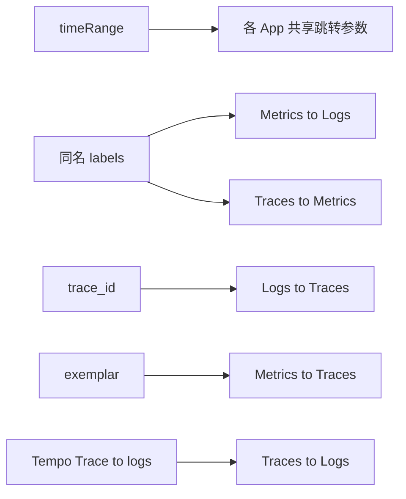

# Grafana Drilldown 机制与 Greptime 对照

## 一、Grafana 如何初始加载

### Metrics Drilldown

- **首屏**：选数据源 + 可选 label filter → 拉指标**目录**，不跑全量时序
- **API**：`GET /api/v1/label/__name__/values`（+ `match[]` 按 label 收窄）
- **点选指标后**：按类型自动生成 PromQL → `query_range`
- **Breakdown**：按 label 拆 series，点 value 加入 filter 栈

### Logs Drilldown

- **首屏 Overview**：按 **service 日志量** 排序的卡片列表
- **API**：Loki `GET /loki/api/v1/index/volume`（非 `query_range` 扫全量）
- **懒加载**：滚到哪个 service 才查该 service 的 volume 时序 + ~100 行预览
- **Show logs**：进入详情，Logs Tab **自动** `query_range`
- **前提**：Loki stream 自带 `service_name` 等 label，无需用户选「logs 表」

### Traces Drilldown

- **首屏**：从 trace 数据**派生 RED**（Rate/Errors/Duration），用户不写 TraceQL
- **下钻**：Filters → Breakdown/Comparison → trace 列表 → 单 trace 详情
- **Exemplar**：RED 图上的菱形 = 带 `trace_id` 的样本点 → 点开 trace

---

## 二、三信号如何关联（Grafana）

Grafana **分三个 App**，关联靠配置与跳转，不是同屏 join：

| 键                   | 强度 | 说明                                     |
| -------------------- | ---- | ---------------------------------------- |
| timeRange            | 弱   | 各 App 独立选择器，跳转时传递            |
| labels（service 等） | 中   | Prom/Loki/Tempo **同名同值**；需运维对齐 |
| trace_id             | 强   | Logs derived field；Metrics exemplar     |
| Trace→Logs           | 中   | Tempo 数据源配置 span attr → Loki label  |

无 exemplar 时 **Metrics→Trace 很弱**。

---

## 三、GreptimeDB 要怎么做

### 核心差异

- **无 Loki** `index/volume` → Logs volume 用 **SQL `GROUP BY`**
- **无 Tempo RED API** → Traces 入口用 **SQL 聚合**（count/error rate/duration）
- **无 stream label** → 必须先 **`resolveLogsTable()`** + field map
- **目标**：不做三个跳转 App，用 **Correlation Context 同屏刷新**

### 初始加载对照表

| 信号    | Grafana                   | Greptime Explore                                                                               |
| ------- | ------------------------- | ---------------------------------------------------------------------------------------------- |
| Metrics | `__name__/values` + match | 扩展 [metrics.ts](src/api/metrics.ts) 加 `start`/`end`/`match[]`；未选 metric 不 `query_range` |
| Logs    | `index/volume` by service | `resolveLogsTable()` → SQL volume by `service_name` + 日志表                                   |
| Traces  | RED from Tempo            | SQL 聚合 + 根 span 列表（`parent_span_id IS NULL`）                                            |

### 关联对照表

| 键            | Greptime 实现                                                      |
| ------------- | ------------------------------------------------------------------ |
| timeRange     | Context 唯一时间源；三 adapter 重查                                |
| filters       | chips → Prom `match[]` + Logs/Traces SQL WHERE（field map 映射列） |
| focusTraceId  | Traces 同区 Gantt + Logs `trace_id = ?`                            |
| Metrics→Trace | 首版靠 Logs 点 trace_id（无 exemplar）                             |

### 建议加载顺序

1. Context 默认 `15m` + 空 filters
2. 并行：`resolveLogsTable` + `resolveTracesTable` + metrics 名列表（带时间）
3. 有表则 Logs/Traces **自动查**；Metrics **仅目录**，点选后再绘图
4. 全部 debounce，per-panel error

### 实现模块（Phase 0 可先做的）

- [explore_drilldown_unified_83100fe3.plan.md](file:///Users/sun/.cursor/plans/explore_drilldown_unified_83100fe3.plan.md) 已含 Context、`resolveLogsTable`、adapters 路径
- 复用：`LogTableData`、`count-chart`、Trace Gantt、`TimeRangeSelect`
- **不改** [logs-query](src/views/dashboard/logs/query/) / 现有 metrics·traces 页职责

---

## 四、与现 codebase 差距

| 项           | 现状                                           | 需要                              |
| ------------ | ---------------------------------------------- | --------------------------------- |
| Metrics 首屏 | 仅 sidebar 拉全量 `__name__`；有 promql 才查图 | 时间+label 预筛列表；点选才 range |
| Logs         | 用户自选任意表 + SQL Builder                   | `resolveLogsTable` + UI 生成 SQL  |
| Traces       | 有自动查 + trace 详情跳转                      | 接入 Context + 同页 Gantt         |
| 跨信号       | 无                                             | Correlation Context + adapters    |

布局（三联 vs Logs 分层首页）仍待定，**不阻塞**上述基建。
