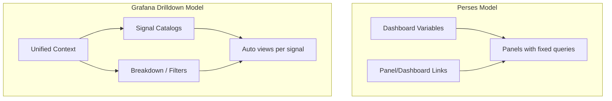
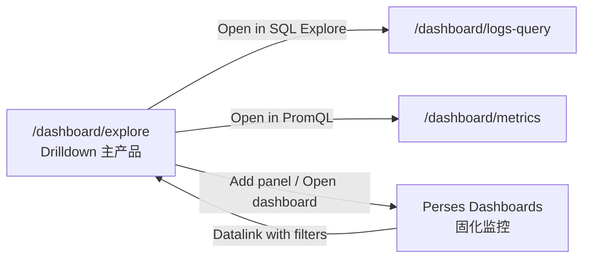

# Perses 与 Drilldown：能力对照与集成策略

## 结论（直接回答）

**Perses 没有 Grafana Metrics/Logs/Traces Drilldown 的等价实现。**

它提供的是 **Dashboard 为中心** 的观测 UI：预置 query 的 panel、顶层 variables、panel/dashboard 链接。最接近 “下钻” 的是 **局部能力**（Prometheus Explorer、TraceTable 行点击、Table datalink），不是跨 Metrics/Logs/Traces 的 **统一 queryless 探索产品**。

你们现有 [explore_drilldown_unified_83100fe3.plan.md](/Users/sun/.cursor/plans/explore_drilldown_unified_83100fe3.plan.md) 中 **「Drilldown 与 Perses 解耦」** 的判断是正确的；Perses 适合作为 **固化看板 + 深链目标**，不适合作为 Drilldown 的主框架。

---

## Perses 里有什么（vs Grafana Drilldown）

| 能力                                         | Perses                                    | Grafana Drilldown      |
| -------------------------------------------- | ----------------------------------------- | ---------------------- |
| Queryless 指标目录 + 自动 PromQL + Breakdown | 无（仅有 PrometheusExplorer，偏 Prom UI） | Metrics Drilldown 核心 |
| Logs service volume / label 探索             | 无独立 App；靠 LogsTable + 手写 SQL       | Logs Drilldown         |
| Traces RED / 属性对比 / 无 TraceQL 探索      | 无；TraceTable + Gantt panel              | Traces Drilldown       |
| 跨 M/L/T 单一 Context 同屏刷新               | 无统一 state；靠 variables 手动对齐       | Explore 套件设计目标   |
| Bookmark / Saved exploration                 | 无                                        | localStorage + 分享    |
| 预置 Dashboard 监控                          | **核心能力**                              | 非 Drilldown 主场景    |

### Perses 官方/生态里与 “探索” 相关的部分

1. **PrometheusExplorer**（`kind: Explore`）
   - 文档：[Prometheus plugin — Explore](https://perses.dev/plugins/docs/prometheus/)
   - 内置 **Metrics Explorer + PromQL debugger**，体验接近 Prometheus 原生 UI。
   - **仅 metrics**；用户仍需理解/编辑 PromQL，没有 Grafana 的 metric catalog 筛选、label breakdown tab、related logs。

2. **Dashboard Variables**
   - `PrometheusListVariable` / `PrometheusLabelValuesVariable` / `PrometheusPromQLVariable` 等。
   - 本质是 **顶层下拉筛选**，所有 panel 引用 `$var`；不是点击 breakdown 行动态加 filter chip。

3. **Links（导航型下钻）**
   - **Dashboard links**（2026 已进 model，[#3905](https://github.com/perses/perses/pull/3905)）：跨 dashboard / 外链，可带 variable + time range。
   - **Table datalink**：`${__data.fields["col"]}` 把单元格值嵌入 URL（[#521](https://github.com/perses/plugins/pull/521)）。
   - **TraceTable `links.trace`**：行点击跳转 trace 详情（本仓库已扩展）。

4. **Greptime 插件 panel 类型**（本仓库 [plugin.ts](src/perses-dashboard/react/plugin.ts)）
   - Metrics: `TimeSeriesChart` + `GreptimeDBTimeSeriesQuery` / PromQL
   - Logs: `LogsTable` + `GreptimeDBLogQuery`
   - Traces: `TraceTable`, `TracingGanttChart` + `GreptimeDBTraceQuery`
   - 均为 **固定 SQL/PromQL**，无 explorer 状态机。

---

## 本仓库已有的 Perses “下钻” 痕迹

| 文件                                                                                | 行为                                                                                      | 局限                                     |
| ----------------------------------------------------------------------------------- | ----------------------------------------------------------------------------------------- | ---------------------------------------- |
| [traceLink.ts](src/perses-dashboard/traceLink.ts)                                   | `TraceTable` 自动补 `links.trace` → `__perses_trace_modal__?traceId=...` 打开 Gantt modal | 仅 trace 行 → 详情；无 M/L 联动          |
| [plugin.ts](src/perses-dashboard/react/plugin.ts)                                   | 注册 `PrometheusExplorer`；TraceTable 默认 trace link                                     | Explorer 未嵌入 Drilldown 产品流         |
| [metrics-explorer.vue](src/views/dashboard/metrics/components/metrics-explorer.vue) | **独立 Vue 页**的 metric 模糊搜索（非 Perses）                                            | 选 metric 后进 PromQL 页，不是 Drilldown |

这些是 **点状能力**，不构成 Grafana 式 Drilldown 产品。

---

## 若在 Perses 上硬做 Drilldown，有哪些路径？

### 方案 A：独立 Explore 产品（推荐，与现规划一致）

- 新建 Vue 路由 `/dashboard/explore`，自有 **Correlation Context** + adapters（Prom API / SQL）。
- Perses **不参与** 核心交互，仅 Phase 2+ 做 **handoff**。

**优点**：与 Grafana Drilldown 产品形态一致；M/L/T 同 Context；不绑 Perses React 栈。  
**缺点**：图表需自建或复用现有 metrics/traces 组件，不能一键复用 Perses panel 配置。

### 方案 B：Perses 仅作 “固化出口”

- Drilldown 探索结束后：**Add to Perses dashboard**（生成 panel JSON）或 **Open dashboard**（带 query string）。
- Perses dashboard link / Table datalink **反向**进入 Explore：`/dashboard/explore?metric=http_requests_total&filter.service=$service&from=$__from&to=$__to`。

**优点**：探索 vs 监控职责清晰；改动 Perses 侧小（链接配置）。  
**缺点**：不能替代 Explore 主页。

### 方案 C：扩展 Perses 插件（新 Explore kind）

- Fork/扩展 `@perses-dev/greptimedb-plugin`，实现 `GreptimeDrilldownExplore`：catalog、breakdown、三信号 tab。
- 需深入 Perses plugin-system、React 嵌入、与 Greptime Dashboard 壳层打通。

**优点**：Dashboard JSON 可声明 “探索入口”。  
**缺点**：工作量大；Perses 上游无此抽象；M/L/T 联动要在插件内重做 Context；与 Vue 主应用分裂。

### 方案 D：在 Explore 内嵌 Perses ViewDashboard

- Explore 某一区域用现有 [DashboardView.tsx](src/perses-dashboard/react/DashboardView.tsx) 渲染 **预置 mini-dashboard**（variables 由 Explore Context 注入）。

**优点**：复用 Perses 图表与 panel 类型。  
**缺点**：React 岛 + 双状态源（Explore Context vs Perses variables）；难以做 queryless catalog/breakdown；体验割裂。

### 方案 E：纯 Perses Variables 模拟 “伪 Drilldown”

- 用多个 panel + 大量 ListVariable 模拟筛选；Table datalink 跳另一张 dashboard。

**优点**：零新代码，适合 **固定 SRE 剧本**。  
**缺点**：无 metric 目录、无动态 breakdown、无 bookmark；维护成本高；**不是** Drilldown 产品。

---

## 推荐集成边界（写入 Drilldown 主规划）

| 阶段      | Perses 角色                                                                    |
| --------- | ------------------------------------------------------------------------------ |
| Phase 0–1 | **无**；专注 Context + adapters + Explore shell                                |
| Phase 2+  | Perses panel/dashboard **datalink → Explore**（传 metric、filters、timeRange） |
| Phase 2+  | Explore **导出 Perses panel JSON** 或 “保存为 dashboard panel”                 |
| 长期      | 可选：Explore 内 “pin chart” 用 Perses 渲染 **单个** TimeSeries（非整页嵌入）  |

**明确不做**：把 Drilldown 主 UI 建在 Perses plugin 内；用 Perses Variables 替代 Explore Context。

---

## 与 Grafana 的差异（为何不能 “照搬 Perses 就有 Drilldown”）

Grafana Drilldown 是 **三个独立 App + 跨 App 深链**（你们已选 **单 Context 同屏**，更贴近 Greptime 差异化）。  
Perses 是 **一个 Dashboard spec + plugins**；没有：

- `information_schema.table_semantics` 驱动的 logs 表解析
- Prom catalog + `inferPromQL` + breakdown
- 跨信号 `trace_id` focus 状态
- exploration bookmark 模型

这些必须在 **Greptime Dashboard 应用层** 实现（见 unified plan Phase 0）。

---

## 决策建议

1. **Drilldown / Explore**：继续 **独立 Vue 产品**，不基于 Perses 框架开发。
2. **Perses**：保持 dashboard 工具定位；只增加 **双向深链** 与可选 **panel 导出**。
3. **PrometheusExplorer**：保留在 Perses 编辑流内作 PromQL 调试；**不要**与 `/dashboard/explore` 合并为同一入口。
4. **TraceTable modal**（`traceLink.ts`）：Explore 的 trace 详情可 **复用同一 Gantt/modal 组件**，但 state 来自 Explore Context，而非 Perses panel link。
