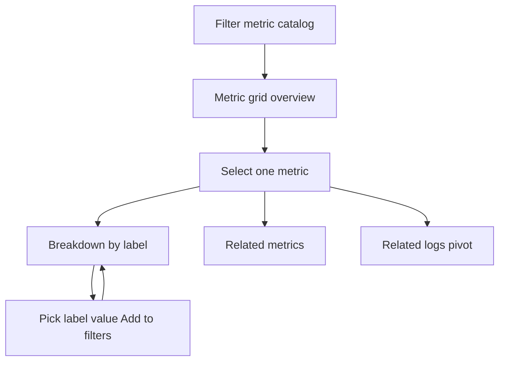
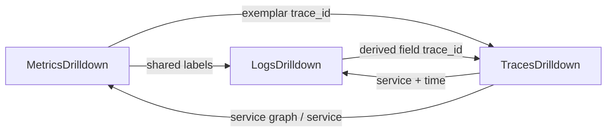

# Explore / Drilldown 规划（同一产品）

## 命名与边界

**Explore 与 Logs Drilldown 是一回事**：Greptime 的 queryless 关联观测入口（对标 Grafana Drilldown 体验，但 Greptime 实现为 SQL + PromQL）。

| | Explore / Drilldown | logs-query |
|--|---------------------|------------|
| 是什么 | **同一产品**（工作名 Explore 或 Drilldown 均可） | **Logs Explore**（已有），高级 SQL |
| 用户 | 点选下钻，不写查询 | SQL Builder / 文本 SQL |
| 路由 | `/dashboard/explore`（规划，**一条路由**） | `/dashboard/logs-query`（保持） |
| 关系 | 主排障入口 | 「Open in SQL Explore」出口 |

**不是**：单独的 `/logs-drilldown` 产品线；**不是**改 `logs-query` 页面。

与 **Perses**、**独立 metrics/traces 全屏页** 解耦；后者可作高级出口。

---

## 已对齐的方向（可先实现）

不论最终布局如何，这些**共用**：

### Correlation Context（单一状态源）

```ts
{
  timeRange
  filters: Array<{ key, op, value }>   // 跨 Metrics/Logs/Traces
  metric?: string
  focusTraceId?: string
  logsTable, tracesTable              // resolve* 结果
  fieldMap: { logs, traces, metrics }
}
```

关联键：**时间**、**labels/attrs**、**traceId** → 变更后各信号区**就地刷新**（不跳 App）。

### Logs 物理表确认 `resolveLogsTable()`

Explore 内 Logs 区（无论占全屏还是一角）都依赖同一条规则：

| 优先级 | 来源 |
|--------|------|
| 1 | URL / Context `logsTable` |
| 2 | Explore **设置**默认表 |
| 3 | `table_semantics` WHERE `signal_type='log'` |
| 4 | 启发式：TIMESTAMP + body/message/content，非 metric 表 |
| 5 | `opentelemetry_logs` 若存在 |
| 6 | 多候选 → 用户选或按近期 volume 自动选 |

校验通过后绑定 **field map**（`body`/`severity_text`/`trace_id`/`service_name` 等）。  
**不读** `logs-query` 的 localStorage。

Traces 表：沿用现有逻辑（`trace_id` + `parent_span_id` 列发现）；Metrics：Prom API + 类型启发式 / `table_semantics`（无 `/metadata` 时）。

### Logs 区行为（Grafana Logs Drilldown 语义，落在 Explore 里）

- 绑定 `logsTable` 后自动 volume + 日志表
- 点 cell / label → 写入 Context `filters`
- `trace_id` → `focusTraceId`，Traces 区响应
- 可选：按 `service_name`（或 primary 列）做 volume 分组卡片——属于 **布局待定** 的一部分

### Metrics 区行为（Grafana Metrics Drilldown 语义）

- 指标列表按 `timeRange` + `filters` 预筛（`__name__/values` + start/end/match）
- 选指标 → 图；Breakdown 点 label → `filters`
- 类型：`table_semantics` → 启发式 → 默认 gauge；counter 用 `sum(rate)`

---

## 待定：具体做法（需定稿）

以下为**同一 Explore 产品**内的 UX 分歧，不是多条产品线：

### 方案 A — 三联同屏（当前倾向）

```text
TopBar（时间 + chips + 表设置）
Metrics（上）
Logs（下左） | Traces（下右）
```

- 优点：一眼对照三信号；改 Context 三块一起变  
- Logs 区：直接 volume + 表，**不一定**先做 service 卡片首页  

### 方案 B — Logs 分层首页 + 同页或展开详情

```text
TopBar
Logs 首页：按 service volume 卡片 → Show logs
（Metrics / Traces 为第二屏、侧栏、或可折叠区）
```

- 优点：更贴 Grafana Logs Drilldown 首页  
- 与 A 可混合：默认三联，Logs 区顶部先做 service 筛选条  

### 方案 C — Tab 主路径

Metrics | Logs | Traces 三个 Tab，共享 Context（Grafana 分 App 式，**优先级低**——与早期「同屏」目标冲突）

### 建议定稿顺序

1. **先定布局**：A / A+B 混合 / 其他  
2. **再定 Logs 首屏**：直接表 vs service 卡片再下钻  
3. **再定 MVP 范围**：是否首版就上 Metrics Breakdown、Patterns 等  

**当前决策（2026-08-28）**：布局**尚未定稿**。实现上**先做基建**（Correlation Context、`resolveLogsTable`、URL sync、查询 adapters），UI 壳子用占位/最小布局，等布局定稿后再铺三联或分层 Logs 首页。

---

## 对照 Grafana（实现参考，非照抄）

- **Metrics**：目录 → 单指标 → label Breakdown → 相关 logs  
- **Logs**：volume → labels/fields → 日志表；`service_name` 由 Loki 提供  
- **我们**：无 Loki；Logs 需 `resolveLogsTable`；关联靠 Context 同屏刷新而非跳 App  

---

## 实现落点（统一）

| 模块 | 路径 |
|------|------|
| Explore 页 | `src/views/dashboard/explore/` |
| Context | `src/store/modules/explore` 或 `use-correlation-context.ts` |
| 表/字段 | `src/observability/resolve-logs-table.ts`、`field-map.ts` |
| 查询 adapters | `src/observability/adapters/{metrics,logs,traces}.ts` |
| 路由 | [dashboard.ts](src/router/routes/modules/dashboard.ts) → `explore` |
| 复用组件 | `LogTableData`、`count-chart`、Trace Gantt、`TimeRangeSelect` |
| 高级出口 | 深链 `logs-query`、`metrics-query`、`traces` |

---

## 阶段（布局定稿后执行）

**Phase 0（当前可做，与布局无关）**

1. 路由 `/dashboard/explore`（最小壳 + 占位三面板）  
2. Correlation Context store + URL sync  
3. `resolveLogsTable()` / traces 表发现 + field map  
4. 查询 adapters（metrics/logs/traces 读 Context）  

**Phase 1（布局定稿后）**

1. 按定稿方案铺 UI（三联 / 分层 / 混合）  
2. 时间 + label + traceId 联动与空态  
3. Metrics 列表预筛、Logs volume+表、Traces 列表/Gantt  

**Phase 2+**

- Metrics Breakdown、service volume 卡片、Labels Tab、深链 `logs-query`、设置页

---

## 成功标准

- **一个** Explore 入口，**一个** Context  
- Logs 表自动确认，不误选 metric 表  
- 不写 SQL 可完成基本排障；要写 SQL 去 `logs-query`  
- 布局定稿后，三信号时间窗与 filters 一致  

---

## 附录 A：Grafana Drilldown 参考

Grafana 是 **分 App + 层层下钻 + 跨 App 跳转**；我们的 Explore 是 **同屏三联 + Context 联动**。下面只描述 Grafana 侧机制，便于对齐取舍。

### Metrics Drilldown（指标内部：一层层看）

整体是 **queryless**：UI 点选生成 PromQL，用户不写查询。



**第 1 层 — 筛指标目录**

- 时间范围 + label filters（如 `service=api`）缩小可见指标
- 还可按前缀/后缀、recording rule、recent、group by 等高级筛
- 主界面是多指标小图网格（overview），一眼扫异常

**第 2 层 — 选中单个指标（Select）**

进入该指标详情，主要 Tab：

| Tab | 作用 |
|-----|------|
| **Breakdown** | 按 **label** 拆开：先看到有哪些 label，再点某个 label → 各 **value** 一条时序；对某个 value **Add to filters** 收窄，再对其它 label 继续拆 |
| **Related metrics** | 同前缀/相近名的其它指标，可再 Select 换指标继续下钻 |
| **Related logs** | 用当前 metric 的 labels 估计相关日志量，并跳到 Logs Drilldown |
| Query results | 原始查询结果（可选） |

**Breakdown 的「层层」本质**：反复 **group by 下一个 label → 选 value 进 filter → 再 group by**，过滤器栈越积越深（例如先 `service`，再 `status`，再 `endpoint`）。这是 Metrics 内的主路径，不是同屏对照 Logs/Traces。

**可视化**：按 metric 类型自动选图（counter/gauge 等），减少手写 `rate()` 等。

### Logs / Traces Drilldown（各自一层层）

| App | 典型层 |
|-----|--------|
| **Logs Drilldown** | 时间 + 流/label 过滤 → volume/patterns → 具体 log 行 → 展开字段 |
| **Traces Drilldown** | 服务/操作/延迟筛选 → trace 列表 → 单 trace 结构/span 详情 |

各 App 独立；共享的是「跳转时带上的时间 + labels（及 trace id）」，不是同屏三面板。

### Metric ↔ Log ↔ Trace 之间（跨信号）

Grafana 靠 **配置好的同名 label + 专用链接**，不是自动 join：



| 方向 | 怎么触发 | 依赖 |
|------|----------|------|
| **Metrics → Logs** | Related logs / 点序列带 labels 跳转 | Prometheus 与 Loki **同名同值** label（如 `service`） |
| **Metrics → Traces** | 点图上的 **exemplar** | 指标样本上挂了 `trace_id`；无 exemplar 则难直达单次请求 |
| **Logs → Traces** | 日志里可点的 **trace ID**（derived fields） | 日志含 trace id + Loki/Tempo 关联配置 |
| **Traces → Logs** | span 上 Logs 链接，或抄 service + 时间去 Logs | service 等资源属性与日志 label 对齐 |
| **Traces → Metrics** | 服务名 / service graph | 指标侧有对应 service label |

另有 **Investigations**（较新）：把各 Drilldown 里的面板拖进同一排查视图做并排——仍是「先分 App 下钻，再拼在一起」，不是默认同屏三联。

### 和 Greptime Explore 规划的差异（取舍）

| | Grafana Drilldown | 本方案 Explore |
|--|-------------------|----------------|
| Metrics 内 | 强：目录 → 单指标 → **Breakdown 层层 label** | 可借鉴 Breakdown；首屏更强调列表预筛 + 选指标绘图 |
| 跨信号布局 | 分 App，跳转 | **同屏** Metrics/Logs/Traces |
| 跨信号键 | labels 对齐 + exemplar + log traceId | 时间 + labels + `trace_id`（无 exemplar 时 Metrics→Trace 偏弱） |
| 心智 | 「一层层钻进一个信号」 | 「一眼对照，点选即三块一起变」 |

可借鉴 Grafana、不必照搬：Metrics 内保留 **Breakdown（按 label 拆 → Add filter）**；跨信号用 Context 同屏刷新，而不是 Related logs 换 App。

---

## 附录 B：方案 A 首屏草案（待确认）

```text
┌─ TopBar ─────────────────────────────────────────────────────────┐
│ 时间范围 [Last 15m] │ Filter chips（初始空）│ 表/映射设置 │
└──────────────────────────────────────────────────────────────────┘
┌─ Metrics（上 ~40%）──────────────────────────────────────────────┐
│ 指标列表（按 timeRange ± labels 预筛）│ 未选时不发 query_range     │
│ 时序图区域                                                      │
└──────────────────────────────────────────────────────────────────┘
┌─ Logs（下左 ~50%）────────────┬─ Traces（下右 ~50%）─────────────┐
│ volume 小图                   │ 根 span 列表（或 Gantt）         │
│ 日志表（最近 N 行）           │                                  │
└───────────────────────────────┴──────────────────────────────────┘
```

### 进入页面时的默认 Context

| 项 | 初始值 | 说明 |
|----|--------|------|
| `timeRange` | **Last 15 minutes** | 与现有 logs/traces 相对时间习惯一致；可改 |
| `filters` | **空**，或来自「默认 labels 设置」 | 有默认 labels 时首屏 chips + Metrics 列表一并预筛 |
| `metric` | **空** | 避免盲目打全量 PromQL |
| `focusTraceId` | **空** | Traces 区显示列表，不是 Gantt |
| `logsTable` / `tracesTable` | **自动发现**，失败则空态 | 优先 `opentelemetry_logs` / `opentelemetry_traces`，否则按列特征发现 |
| field map | **OTEL 默认** | `body`/`severity_*`/`trace_id`/`service_name` 等，可覆盖 |

### 各区域首屏内容（有数据时）

**1. TopBar**

- 时间选择器（唯一时间源）
- Filter chips 区（空时占位文案：`Click labels or cells to filter`）
- 轻量设置：Logs 表、Traces 表（高级：字段映射）
- 可选：关联强度提示条（仅在有弱关联过滤时出现，首屏无）

**2. Metrics 区（列表预筛 + 选指标绘图）**

| 元素 | 首屏 |
|------|------|
| 指标列表 / 搜索 | **按当前 `timeRange`（+ 已有 label chips）预筛**后展示，不是全库裸列表 |
| 折线图 | **未选指标**：空态「Select a metric to plot」 |
| Legend / label 操作 | 有序列后才出现；点 label → 写入 TopBar chips → **列表与图一起再筛** |

**列表如何按 labels + timeRange 筛选（可行，纳入 Explore）**

现有 [metrics.ts](src/api/metrics.ts) 的 `getMetricNames` / `searchMetricNames` 走 `/label/__name__/values`，已支持 `match`，但**尚未传 `start`/`end`**。Explore 扩展为：

```text
GET .../label/__name__/values
  ?start=<from>&end=<to>
  &match[]={service_name="checkout",env="prod"}   // 由 TopBar chips 生成；无 chips 时可仅 start/end
  &limit=500
```

备选：`/series?match[]={...}&start=&end=` 再对 `__name__` 去重（更准、可能更重）。

| Context | 指标列表行为 |
|---------|--------------|
| 仅 timeRange | 只列出该时间窗内**有序列**的指标名 |
| + label chips | `match[]` 带上对应 label matchers，列表再收窄 |
| 用户输入搜索 | 在上述结果上叠加 `__name__=~"..."`（同一 start/end/match） |
| 改时间 / 增删 chip | **debounce 刷新列表**；若当前已选 metric 不在新列表中 → 清空选中并提示，或保留图但标「当前过滤下无匹配」 |

可选「默认 labels 设置」（Explore 设置保存常用 `service_name` / `env`）：进入页时写入初始 chips，从而**首屏指标列表即按标签收窄**；与 TopBar chips 同一套 filters，不另起状态。

不在首屏自动选「第一个指标」——列表已按时间/标签缩小后再由用户点选。

**3. Logs 区（初始即自动查询）**

进入后用 `timeRange` 自动跑一次（无需点 Run）：

| 元素 | 内容 |
|------|------|
| Volume 小图 | 时间范围内日志量（可按 `severity_text` 分色，有则显示） |
| 表列（精简） | `timestamp`、`severity_text`（或 `level`）、`body`（或 `message`）、`trace_id`（有则） |
| 行数 | 默认 limit（如 100），新→旧 |
| 行交互 | 点 `severity`/`service` 类 cell → chip；点 `trace_id` → 设 `focusTraceId` |

**4. Traces 区（初始即自动查询）**

| 元素 | 内容 |
|------|------|
| 模式 | **列表**（无 focusTraceId） |
| 默认过滤 | `parent_span_id IS NULL`（根 span，与现 traces 页一致） |
| 列 | `timestamp`、`service_name`、`span_name`、`duration_nano`、`trace_id`、`span_status_code`（有则） |
| 行交互 | 点行 / `trace_id` → 同区切 **Gantt**；点 `service_name` → chip |

**5. 空态 / 降级**

| 情况 | UI |
|------|-----|
| 无 logs 表 | Logs 区：引导选表或说明如何 OTLP 写入 |
| 无 traces 表 | Traces 区同上 |
| 有表但时间窗无数据 | 面板内 empty + 建议扩大时间 |
| Metrics 未选 | 图区空态；列表仍按时间/labels 展示可选项 |
| Metrics 列表为空 | 提示扩大时间或放宽 labels |
| 部分信号失败 | 该面板 error，另两面板照常 |

### 首屏刻意不放的内容

- SQL / PromQL 编辑器（进阶用「在独立页打开」或面板内折叠）
- 多指标对比、dashboard 变量
- Perses 看板 / 面板 / 与 Perses 的跳转联动
- 默认最大化某一信号
- Profiles

---

## 如何关联展示（同一 Context，三种键）

关联不是「跳转」，而是 **同一时间窗 + 同一组 filters + 可选 focusTraceId**，三块一起变。

```mermaid
flowchart TB
  subgraph context [Shared Context]
    T[timeRange]
    F[filters chips]
    Tid[focusTraceId]
  end
  T --> M[Metrics list and chart]
  T --> L[Logs volume and table]
  T --> Tr[Traces list or Gantt]
  F --> M
  F --> L
  F --> Tr
  Tid -->|"strong"| Tr[Traces list or Gantt]

说明：`timeRange` / `filters` 同时驱动 **指标名列表**（`__name__` values）与已选指标的 `query_range`。

### 关联键 → UI 行为

| 关联键 | 用户怎么触发 | 三面板如何一起变 |
|--------|--------------|------------------|
| **时间** | TopBar 改时间；任一面板 **brush** volume/折线 | Metrics / Logs / Traces **全部**按新窗重查；chips 保留 |
| **Labels** | Metrics legend 点 label；Logs/Traces 点 `service_name` 等 cell；或 Explore 默认 labels 设置 | Chip 出现在 TopBar；**Metrics 列表**用 `match[]` 重拉；已选指标的图带 matcher；Logs/Traces SQL 映射条件 |
| **traceId** | 点 Logs/`Traces` 的 `trace_id` 或选中一行 | `focusTraceId` 写入；**Traces → Gantt**；Logs **追加** `trace_id=`（可一键清除 chip 回到宽列表）；Metrics **不强制变**（无 exemplar 时保持当前图，仅时间/label 仍生效） |

### 首屏默认关联级别

打开 Explore、尚未点选时：

- **仅时间对齐**（弱关联的基线）：三块看的是同一 15m 窗口里的「发生了什么」
- 无 label、无 traceId → 用户先横向扫 Logs + Traces，再决定选哪个 metric / 点哪个 service / 哪条 trace

### 交互后的关联展示（由浅入深）

**L1 — 时间对齐（默认 / brush）**

- 视觉：共用 TopBar 时间；brush 后时间控件更新为绝对区间
- 数据：三查询同一 `[from, to]`；**Metrics 列表按新窗重拉**
- 文案：无需提示

**L2 — Label 对齐（点选 service 等）**

- 视觉：TopBar chips（如 `service_name=checkout`）；三面板标题旁可显示「filtered」
- 数据：PromQL `metric{service_name="checkout"}`；**指标列表 `match[]` 收窄**；Logs/Traces SQL 映射到 `service_name` 或 resource 路径
- 文案：若某信号缺该列 → 该面板提示「无 service_name，仅按时间」并仍显示时间窗结果（不强行空）

**L3 — Trace 对齐（点 trace_id）**

- 视觉：chip `trace_id=…`；Traces 区从列表切 Gantt；Logs 表只留该 trace；可选高亮当前行
- 数据：Logs/Traces 强过滤；Metrics 仍 L1/L2
- 退出：清 chip / 「Back to trace list」恢复 L1/L2

### 同屏联动时序（用户路径）

```mermaid
sequenceDiagram
  participant U as User
  participant Bar as TopBar
  participant M as Metrics
  participant L as Logs
  participant Tr as Traces
  Note over Bar,Tr: 首屏：15m；L/Tr 自动查；M 列表按时间预筛
  U->>M: 从预筛列表选择指标
  M->>M: 绘折线（同时间窗）
  U->>M: brush 尖刺
  M->>Bar: 更新 timeRange
  Bar->>L: 重查
  Bar->>Tr: 重查
  Bar->>M: 重筛指标列表
  U->>L: 点 service 或点 Metrics label
  L->>Bar: 增加 filter chip
  Bar->>M: 列表 match 收窄 + 图带 matcher
  Bar->>Tr: 重查带 service
  U->>L: 点 trace_id
  L->>Bar: focusTraceId
  Bar->>Tr: 同区 Gantt
  Bar->>L: 表收窄到该 trace
```

### 查询侧对应（实现时 adapter 用）

| Context | Metrics | Logs（示例语义） | Traces（示例语义） |
|---------|---------|------------------|-------------------|
| 仅时间 | 有 metric 才 `query_range` | `WHERE ts IN range ORDER BY ts DESC LIMIT N` | 根 span + 时间窗 |
| + filters | label matchers **+ 刷新指标名列表** | 映射列 / JSON path | `service_name` 等 |
| + focusTraceId | 不变 | `AND trace_id = ?` | `WHERE trace_id = ?` → Gantt |

---

## 布局与模块（摘要）

- 路由：`/dashboard/explore`
- Context store：`timeRange` / `filters` / `metric` / `focusTraceId` / schemaBinding
- 三面板组件同页订阅 Context；debounce 重查
- 复用现有 time-range、metrics 选指标、logs volume/table、traces table/Gantt
- 独立 metrics/logs/traces 页保留为全屏高级出口

---

## 阶段（与首屏相关）

1. **首屏可看**：TopBar + Logs/Traces 自动查询 + Metrics 列表按 timeRange（及默认 labels）预筛
2. **时间联动**：brush / 改时间 → 三面板刷新 + **Metrics 列表重筛**
3. **Label 联动**：chips → 三面板过滤 + **Metrics 列表重筛**
4. **Trace 联动**：`trace_id` → Gantt + Logs 收窄
5. 其后：Maximize、映射配置、深链到现有独立查询页（不接 Perses）

---

## 成功标准（针对「初始 + 关联」）

- 打开 Explore：**不点 Run** 即可在下半屏看到同时段 Logs 与 Traces（有表时）
- Metrics 列表随 **timeRange / label chips** 变化，只展示窗口内（及匹配 labels）有数据的指标
- 选中指标后与下方时间、chips 一致；Brush 或改时间后三块数据窗口一致
- 点 `service_name` 后，chips、指标列表、Logs/Traces 过滤一致
- 点 `trace_id` 后，同页看到 Gantt，且 Logs 与之对齐
