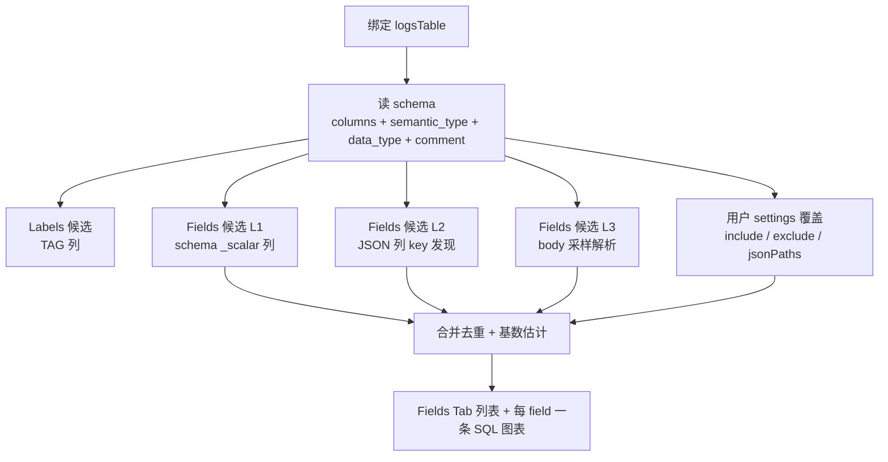
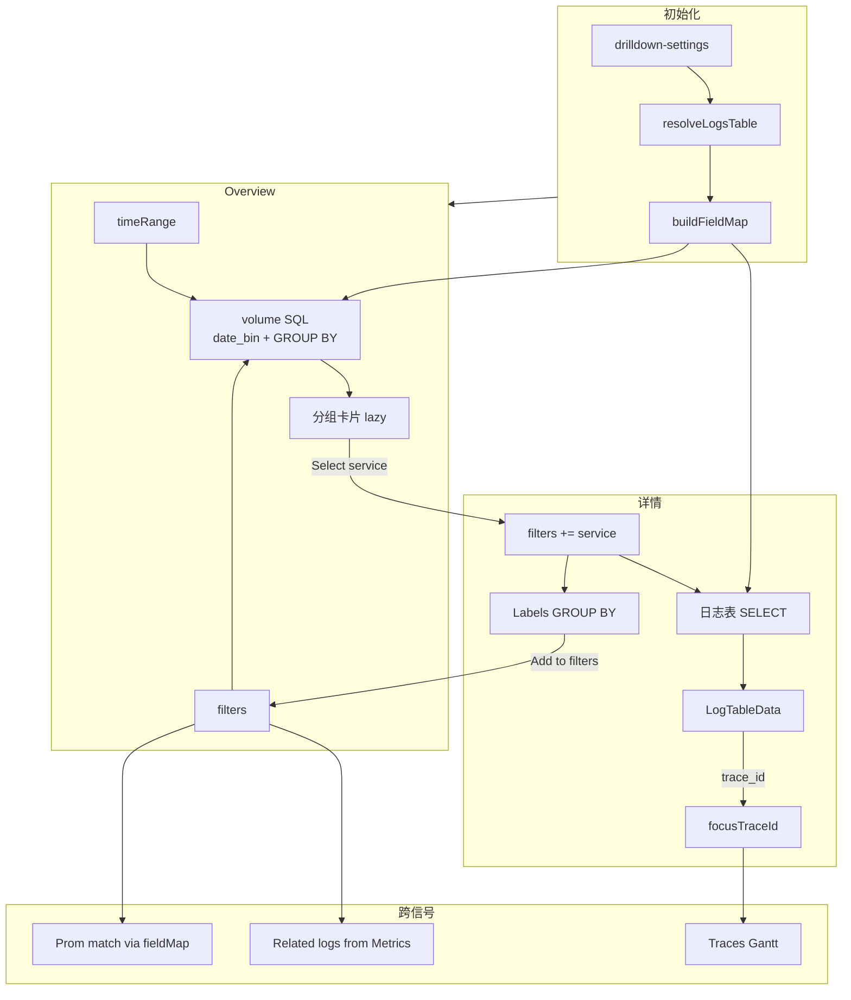

# Grafana Logs Drilldown 功能清单与 Greptime 取数对照

> 本计划**只覆盖 Logs Drilldown**（Explore 内 Logs 信号区），不展开 Metrics/Traces 专项。产品总规划见 [01-product-explore-master.plan.md](./01-product-explore-master.plan.md)；Metrics 侧 Related logs 见 [02-metrics-drilldown-spec.plan.md](./02-metrics-drilldown-spec.plan.md) §Related logs。
>
> **与 Metrics 规则对照、公共实现模块**：见 [metrics-vs-logs-drilldown-rules.md](../architecture/metrics-vs-logs-drilldown-rules.md)。
>
> Grafana 参考：[Logs Drilldown](https://grafana.com/docs/grafana/latest/visualizations/simplified-exploration/logs/)、[logs-drilldown 仓库](https://github.com/grafana/logs-drilldown)、[Configure Logs Drilldown](https://grafana.com/docs/grafana/latest/explore/simplified-exploration/logs/access/configure/)

---

## 产品心智（一句话）

Grafana Logs Drilldown = **queryless**：在 Loki 上按 **service 日志量** 浏览 → 选 service → 用 **labels / fields / patterns** 层层收窄 → 看日志表，用户不写 LogQL。

Greptime Explore 对标时：

```text
resolveLogsTable + fieldMap
  → SQL volume by primaryGroupBy（对标 index/volume）
  → 选 service / 点 filter chip
  → SQL 日志表 + Labels breakdown
  → trace_id → focusTraceId（同屏 Traces）
  → Open in SQL Explore（高级出口）
```

**核心差异**：Greptime **无 Loki stream / index/volume API**；必须先绑定 **一张 SQL 表** + **fieldMap**，用 `GROUP BY` + `date_bin` 替代 Loki volume。

---

## 功能总表（Grafana → Greptime 取数）

### A. 前置：logs 表与字段语义

| # | Grafana 功能 | 用户看到什么 | Greptime Dashboard 如何取数 | 现状 / 缺口 |
|---|--------------|--------------|----------------------------|-------------|
| A1 | **数据源选择** | 左上角选 Loki 实例 | Explore Context 绑定 **database** + `resolveLogsTable()` 结果 | logs-query 用户手选表；Explore **无** |
| A2 | **Service 发现** | Loki 自动从 stream label 识别 `service_name` | `table_semantics WHERE signal_type='log'` → 唯一则绑定；否则 settings / 用户选 | Dashboard **未读** table_semantics |
| A3 | **discover_service_name** | Loki 配置指定 service label | `drilldown-settings.logs.primaryGroupBy`（默认 `service_name` → `scope_name`） | 无 |
| A4 | **unknown_service** | 无 service label 时兜底 | `primaryGroupBy` 列 NULL → 显示 `unknown` 或单列「All logs」 | 无 |
| A5 | **字段映射** | Loki stream labels 即字段 | `buildFieldMap(table)`：OTEL 列名 + `semantic_type` + `column_comment` + settings 覆盖 | 无 fieldMap |
| A6 | **Default fields（Beta）** | 管理员按 label 规则配置默认列 | Phase 2+：`drilldown-settings` 按 service 规则配置展示列 | 无 |
| A7 | **Volume API 开关** | Loki `volume_enabled` | **不需要**；直接用 SQL `COUNT(*)` | N/A |
| A8 | **多 logs 表** | 多 Loki DS | MVP **单表**；settings 指定；Phase 2+ 多表 picker | 无 |

#### `resolveLogsTable(ctx, settings)` 优先级

| 优先级 | 来源 |
|--------|------|
| 1 | URL `?logsTable=` / Context `logsTable` |
| 2 | **Drilldown 设置** → 默认 logs 表（按 database） |
| 3 | `information_schema.table_semantics WHERE signal_type='log'` |
| 4 | 列启发式：`semantic_type=TIMESTAMP` + (`body`\|`message`\|`content`)，且 `ENGINE != metric` |
| 5 | 已知 OTLP 表名 `opentelemetry_logs` / `genai_conversations` 若存在 |
| 6 | 多候选 → **设置页或首屏**让用户选；**禁止**静默选 metric 表 |

**不读** logs-query 的 `localStorage`（`logs-query-table`）。

校验失败 → Logs 区空态 + 引导打开 **Explore 设置**。

#### `buildFieldMap(table)` 自动识别

| 语义 | 自动识别顺序 |
|------|--------------|
| time | `semantic_type=TIMESTAMP` → `timestamp` / `ts` |
| body | `body` → `message` → `content` |
| severity | `severity_text` → `level` |
| traceId | `trace_id` |
| service | `service_name` → `scope_name` → `settings.jsonPaths`（如 `resource_attributes.service.name`） |
| primaryGroupBy | settings 指定；默认 `service_name`，无则 `scope_name`，再无则 **不分组**（全量单卡片） |

用户设置在 `drilldown-settings` **覆盖**自动值；写入 Context `fieldMap.logs`。

```ts
type DrilldownSettings = {
  logs: {
    table?: string
    fieldMap: {
      time: string
      body: string
      severity?: string
      traceId?: string
      service?: string
      primaryGroupBy?: string
    }
    jsonPaths?: Record<string, string>
    defaultColumns?: Array<{ when: Record<string, string>; columns: string[] }>  // Phase 2+
  }
}
```

---

### B. 首页：Service / 分组 Overview（对标 Loki index/volume）

| # | Grafana 功能 | 用户看到什么 | Greptime 取数 | 现状 / 缺口 |
|---|--------------|--------------|---------------|-------------|
| B1 | **Service 列表** | 按日志量排序的 service 卡片 | SQL volume by `primaryGroupBy`；`ORDER BY count DESC` | 无；logs-query 仅全表 count |
| B2 | **index/volume API** | `GET /loki/api/v1/index/volume` | **无 Loki** → 见下方 SQL 模板 | 无 |
| B3 | **Lazy load 卡片** | 滚到哪个 service 才查该 service 时序 + ~100 行预览 | IntersectionObserver → 对该 `primaryGroupBy` 值单独跑 volume 时序 + `LIMIT 100` | logs-query 一次查全表 |
| B4 | **Search service** | 搜索框过滤 service 名 | 客户端 `includes` / regex filter 已加载列表 | 无 |
| B5 | **Recently selected** | 最近选中的 service 置顶 | localStorage `recent-log-services` | 无 |
| B6 | **Time picker** | 改时间重拉 volume | Context `timeRange` → SQL WHERE on time 列 | logs-query 已有 TimeRangeSelect |
| B7 | **Refresh / Live** | 自动刷新；query streaming | MVP：debounce 重查；可选 3s poll（复用 logs-query Live）；**无** Loki shard streaming | logs-query 有 3s Live |
| B8 | **Break down by label**（较新） | 首页可按任意 indexed label 分组，不限 service | `primaryGroupBy` 可配置为任意 **TAG 列**（settings 或 Phase 1 UI 切换） | 无 |
| B9 | **总 volume 时序** | Overview 顶部总日志量曲线 | `date_bin + COUNT(*)` 无 group（复用 [count-chart](src/components/count-chart/index.vue)） | count-chart **已有** |

#### Greptime SQL：首页 volume（对标 index/volume）

**全库总 volume 时序**：

```sql
SELECT
  date_bin(INTERVAL '1m', "<timeCol>") AS bucket,
  COUNT(*) AS log_count
FROM "<logsTable>"
WHERE "<timeCol>" >= <from> AND "<timeCol>" <= <to>
  AND <ctxFiltersAsSql>
GROUP BY bucket
ORDER BY bucket ASC
LIMIT 500
```

**按 primaryGroupBy 分组（service 卡片列表）**：

```sql
SELECT
  "<primaryGroupByCol>" AS group_key,
  COUNT(*) AS log_count
FROM "<logsTable>"
WHERE "<timeCol>" >= <from> AND "<timeCol>" <= <to>
  AND <ctxFiltersAsSql>
GROUP BY group_key
ORDER BY log_count DESC
LIMIT 200
```

**单卡片 lazy 时序**（滚入视口，且 `group_key = 'checkout'`）：

```sql
SELECT
  date_bin(INTERVAL '1m', "<timeCol>") AS bucket,
  COUNT(*) AS log_count
FROM "<logsTable>"
WHERE "<timeCol>" >= <from> AND "<timeCol>" <= <to>
  AND "<primaryGroupByCol>" = 'checkout'
  AND <ctxFiltersAsSql>
GROUP BY bucket
ORDER BY bucket ASC
LIMIT 200
```

**单卡片 lazy 预览**（~100 行）：

```sql
SELECT
  "<timeCol>", "<severityCol>", "<bodyCol>", "<traceIdCol>"
FROM "<logsTable>"
WHERE ... AND "<primaryGroupByCol>" = 'checkout'
ORDER BY "<timeCol>" DESC
LIMIT 100
```

`date_bin` 间隔：复用 [count-chart](src/components/count-chart/index.vue) 逻辑（60s–3600s 按时间窗长度）。

---

### C. Service 详情 / 日志主视图

| # | Grafana 功能 | 用户看到什么 | Greptime 取数 | 现状 / 缺口 |
|---|--------------|--------------|---------------|-------------|
| C1 | **Select service** | 点卡片进入 service 详情 | 写入 Context `filters`：`{ key: primaryGroupBy, op: '=', value: 'checkout' }` | 无共享 Context |
| C2 | **Show logs / 日志表** | 自动展示过滤后日志行 | `SELECT` 映射列 + WHERE + `ORDER BY time DESC LIMIT N` | LogTableData **已有** |
| C3 | **Log line 展示** | 全文或 default fields | 默认 body 列；Phase 2 default columns 规则 | LogDetail drawer **已有** |
| C4 | **Show time** | 表内时间列 | fieldMap.time | 可配 |
| C5 | **Infinite scroll** | 自动加载更多行 | Phase 2：`use-log-time-pagination` 时间游标（**无** OFFSET） | hook **已有** |
| C6 | **Line limit** | Loki max lines | MVP `LIMIT 500`；设置可调 | logs-query 默认 1000 |
| C7 | **Share link** | 短链分享某行/时间窗 | URL sync Context（time + filters + focusTraceId） | logs-query 有 URL sync |
| C8 | **Open in Explore** | 跳转 Grafana Explore 带 LogQL | **Open in SQL Explore** → `/dashboard/logs-query?...` | 需新建深链协议 |
| C9 | **Chart zoom** | 刷选缩小时间 | count-chart brush → 更新 Context `timeRange` | count-chart **已有** |

#### Greptime SQL：日志主表

```sql
SELECT
  "<timeCol>" AS ts,
  "<severityCol>" AS level,
  "<bodyCol>" AS body,
  "<traceIdCol>" AS trace_id,
  "<primaryGroupByCol>" AS service
FROM "<logsTable>"
WHERE "<timeCol>" >= <from> AND "<timeCol>" <= <to>
  AND <ctxFiltersAsSql>
ORDER BY "<timeCol>" DESC
LIMIT 500
```

`<ctxFiltersAsSql>`：Context `filters[]` 经 **fieldMap 反向映射**（chip key → 列名）生成 AND 条件；支持 `=`, `!=`, `=~`, `!~`（SQL 侧 `LIKE` / `NOT LIKE` / regex 若引擎支持）。

---

### D. Labels / Fields Breakdown（层层收窄）

| # | Grafana 功能 | 用户看到什么 | Greptime 取数 | 现状 / 缺口 |
|---|--------------|--------------|---------------|-------------|
| D1 | **Labels 列表** | 当前结果集可用 label 键 | `SELECT DISTINCT` 或 schema：`semantic_type=TAG` 列 + 常用 OTEL 列 | getTableSchema **部分** |
| D2 | **Label values** | 某 label 各值及计数 | `SELECT col, COUNT(*) ... GROUP BY col ORDER BY COUNT DESC` | FunnelChart 模式 **可复用** |
| D3 | **Add to filters** | 点 value → 顶栏 filter chip | 写入 Context `filters[]` → 三信号重查 | 无 |
| D4 | **Fields** | 从 log line / JSON / 标量列解析出的键 | **L1** schema 标量 + **L2** JSON 采样 + **L3** body 解析（见 §Field 发现策略）；非 OTEL 表靠 settings | 无 |
| D5 | **Reset filters** | 恢复默认 service 选择 | 清空 filters 或保留 primaryGroupBy | 无 |
| D6 | **Max series limit** | 高基数 label 报错 | MVP：GROUP BY `LIMIT 50`；超出提示收窄 filters | 无 |
| D7 | **No labels selected** | 至少选一个 label filter | 首页选 service 后自动有 primaryGroupBy filter；空态引导 | — |

#### Select / Add to filters 规则（Logs 区）

与 Metrics 不同，Logs Drilldown **没有**「Select label → value 列表」三步 PromQL 结构；主路径是：

```text
1. 点 service 卡片 → Add filter（primaryGroupBy=value）→ 进入详情 + 日志表
2. Labels Tab：点某 label 的 value 条 → Add to filters
3. 日志表：点 severity / service / 任意 TAG 单元格 → Add to filters（复用 DataTable context menu）
4. 点 trace_id → focusTraceId（L3，不是 filter）
```

| 交互 | 效果 |
|------|------|
| 点 service 卡片 | `filters += { primaryGroupBy, '=', value }` |
| Labels breakdown 点 value | `filters += { labelKey, '=', value }` |
| 表 cell context menu | `filters += { column, op, value }` |
| 点 trace_id | `focusTraceId = value`（Traces 区 Gantt） |
| Reset filters | 清除除 timeRange 外 filters；或回到 Overview |

**fieldMap 与 chip 展示名**：Prom/Metrics 用 `service_name`，logs 表可能是 `scope_name` — chip 展示用 **统一 key**（如 `service`），SQL 用 fieldMap 映射列名。

---

## Field 发现策略（非 OTEL / 通用 logs 表）

> logs 表**不一定是** `opentelemetry_logs`。Explore **不能**假设 OTEL 列名；Fields（及 Labels）发现走 **分层 pipeline**，与 `resolveLogsTable` / `buildFieldMap` 同级。

### Labels vs Fields 在 Greptime 里的划分

| Drilldown 概念 | 发现来源 | 是否靠 schema  alone |
|----------------|----------|----------------------|
| **Labels** | `semantic_type = TAG` 的列；或 settings 指定为 label 的列 | ✓ 多数情况够用 |
| **Fields** | **非 TAG、非 TIMESTAMP** 的可分组列 + JSON 内 key + body 解析出的 key | ✗ 需多层 |

**注意**：Grafana 的 Field ≠ Greptime `semantic_type=FIELD`。`FIELD` 类型列里既有 `body`（需再解析），也有可直接 breakdown 的 `severity_text`；**TAG 列归 Labels Tab，不要进 Fields 列表**。

### 发现 pipeline（优先级）



#### L0：用户配置（最高优先级）

`drilldown-settings.logs.fieldsDiscovery`（建议结构）：

```ts
fieldsDiscovery?: {
  includeColumns?: string[]      // 强制展示（即使启发式未命中）
  excludeColumns?: string[]      // 永不进 Fields（如 body 原文、超大 blob）
  jsonColumns?: string[]         // 参与 JSON key 扫描的列，默认 ['log_attributes','resource_attributes'] 若存在
  bodyParse?: 'off' | 'json' | 'logfmt' | 'auto'  // 是否对 body 列做采样解析
  maxFields?: number             // 列表上限，默认 50
  maxCardinality?: number        // 单 field 估计 distinct 超阈值则标记「高基数」或隐藏 breakdown 图
}
```

非 OTEL 表在 **Explore 设置** 里应允许用户：指定 time/body/service 列 + **勾选哪些列参与 Labels / Fields**。

#### L1：Schema 标量列（Phase 2 Fields MVP — **推荐先做**）

读 `information_schema.columns`（Explore 路径含 `column_comment`）：

| 规则 | 动作 |
|------|------|
| `semantic_type = TAG` | → **Labels**，不进 Fields |
| `semantic_type = TIMESTAMP` | → 时间轴，不进 Fields |
| `data_type` 为 String / Int / 等**标量** | → Fields 候选 |
| 列名启发式 | `severity*`、`level`、`status*`、`host`、`pod`、`env` 等优先展示 |
| 列名 / comment 黑名单 | `body`、`message`、`content`、`*_attributes`（JSON 整体）、`raw` → 不当作 scalar field，走 L2/L3 |
| `table_semantics.signal_type=log` | 可信时缩小候选集 |

**图表 SQL（string / 低基数 int）** — 对标 Grafana `sum by (field) count_over_time`：

```sql
SELECT
  date_bin(INTERVAL '1m', "<timeCol>") AS bucket,
  "<fieldCol>" AS value,
  COUNT(*) AS cnt
FROM "<logsTable>"
WHERE <timeRange + ctxFilters> AND "<fieldCol>" IS NOT NULL
GROUP BY bucket, value
ORDER BY bucket
LIMIT 5000
```

**数值列** — 对标 `avg_over_time | unwrap`：

```sql
SELECT
  date_bin(INTERVAL '1m', "<timeCol>") AS bucket,
  AVG("<numericCol>") AS avg_val
FROM "<logsTable>"
WHERE <timeRange + ctxFilters>
GROUP BY bucket
```

复用 [count-chart](src/components/count-chart/index.vue) 渲染；多 `value` 时前端分 series 堆叠。

#### L2：JSON 列 key 发现（Phase 2+ — 非 OTEL 常见）

表里有 `Json` 类型列（OTEL 的 `log_attributes`；业务表可能是 `metadata`、`extra`、`labels_json`）：

1. **确定 JSON 列**：schema `data_type` 含 `Json` / `JSON`，或 settings `jsonColumns`。
2. **采样**：在当前 Context（time + filters）下：

```sql
SELECT "<jsonCol>"
FROM "<logsTable>"
WHERE <where>
ORDER BY "<timeCol>" DESC
LIMIT 200
```

3. **客户端**（或 SQL UDF 若可用）合并所有 object 的 **top-level keys** → field 名列表。
4. **基数估计**（每个 key）：

```sql
SELECT COUNT(DISTINCT json_extract("<jsonCol>", 'key')) AS card
FROM "<logsTable>"
WHERE <where>
LIMIT 1
```

5. **图表 SQL**：

```sql
SELECT date_bin('1m', "<timeCol>") AS bucket,
       json_extract("<jsonCol>", 'status') AS value,
       COUNT(*) AS cnt
FROM "<logsTable>"
WHERE <where> AND json_extract("<jsonCol>", 'status') IS NOT NULL
GROUP BY bucket, value
```

**限制**：嵌套 JSON 默认只暴露 **第一层 key**；更深 path 需 settings 手工配或 Phase 3。

#### L3：body 列内容解析（Phase 2+ — 对标 Loki `| json` / `| logfmt`）

当正文在 `body` / `message` / `content` 列且 **无** 结构化列时：

| 方法 | 做法 | 适用 |
|------|------|------|
| **JSON try** | 采样 200 行，`JSON.parse(body)` 成功则收集 keys | JSON 日志 |
| **logfmt regex** | 采样 + `(\w+)=` 或简单 logfmt 解析 | Go/k8s 常见格式 |
| **不解析** | 仅 fulltext / `LIKE` 搜索，**不出 Fields 列表** | 纯文本日志 |

`bodyParse: auto`：采样 N 行，>70% 可 JSON 解析 → 走 JSON；否则 logfmt；都失败 → Fields Tab 空态 + 引导 settings。

**不做**（MVP）：全表扫描 body 建 inverted index；对标 Loki `detected_fields` 的全_shard 扫描。

#### L4：基数与展示 guard

| 检查 | 阈值（默认） | 行为 |
|------|-------------|------|
| `COUNT(DISTINCT col)` | > 500 | 列表仍显示，**不提供** value breakdown 图；或仅 Names 模式 |
| GROUP BY 结果 series 数 | > 50 | 截断 + 提示收窄 filters |
| `trace_id` / `request_id` 类 | 自动识别 | 默认 **exclude**，避免误当 breakdown field |

### 非 OTEL 表示例（如 `public.logtest`：`ts`, `message`, `content`, `line_no`）

| 列 | 发现结果 |
|----|----------|
| `ts` | TIMESTAMP → 时间 |
| `message` / `content` | body 列 → L3 采样；若无结构则 Fields Tab 仅 **level/host 等若另有列** |
| `line_no` | 数值 FIELD → Fields 候选（avg 图） |
| 无 TAG | Labels Tab 空或仅 settings 指定 `primaryGroupBy`；首页可能 **All logs** 单卡片 |

### 与 Grafana `/detected_fields` 的对照

| Grafana | Greptime Explore（通用表） |
|---------|---------------------------|
| 单 API 返回 field 名 + type + cardinality | **L1 schema + L2 JSON 采样 + L3 body 解析** 组合 |
| 自动 \| json \| logfmt | settings `bodyParse` + 客户端采样 |
| 每 field 一条 LogQL range | **每 field 一条 SQL**（`date_bin` + `GROUP BY` 或 `AVG`） |

### 实现模块（建议）

| 函数 | 职责 |
|------|------|
| `discoverLabelColumns(schema, settings)` | TAG + 配置 → Labels 列表 |
| `discoverFieldColumns(schema, settings)` | L1 标量 Fields |
| `discoverJsonFieldKeys(table, jsonCol, ctx, sampleN)` | L2 |
| `discoverBodyFieldKeys(table, bodyCol, ctx, sampleN, mode)` | L3 |
| `estimateCardinality(table, fieldExpr, ctx)` | 基数 guard |
| `buildFieldVolumeSql(field, ctx, fieldMap)` | 生成单张图表 SQL |

**Phase 2 Fields MVP 建议**：只做 **L0 + L1**（schema 标量 + 用户 include/exclude）；L2/L3 按表类型按需开启。

---

### E. Log patterns / 全文搜索（Grafana 高级能力）

| # | Grafana 功能 | 用户看到什么 | Greptime 取数 | 现状 / 缺口 |
|---|--------------|--------------|---------------|-------------|
| E1 | **Log patterns** | 自动聚类相似 log line | Loki pattern API；Greptime **无** → Phase 2+ 客户端采样 + 简易模板，或 **跳过** | 无 |
| E2 | **Line filter / 字符串** | 管道 `|= "error"` | MVP：`body LIKE '%error%'` 或 Context `filters` 加 body 条件；Phase 2 搜索框 | SQL Builder LIKE **已有** |
| E3 | **Regex filter** | LogQL `\|~ "regex"` | `body REGEXP '...'` 或 `LIKE`（视 Greptime SQL 能力） | 无 UI |
| E4 | **JSON 解析** | `\| json` | 若 body 为 JSON：`json_extract` / 虚拟列；或展示 `log_attributes` 列 | 视表结构 |
| E5 | **Detected fields** | 从原始行发现字段 | 无 Loki API → **discoverFieldColumns + discoverJsonFieldKeys + discoverBodyFieldKeys** | 无 |

**MVP 建议**：只做 **顶栏字符串搜索**（映射为 `body LIKE`），不做 patterns 聚类。

---

### F. 跨信号关联（Logs 视角）

| # | Grafana 功能 | 用户看到什么 | Greptime 取数 | 现状 / 缺口 |
|---|--------------|--------------|---------------|-------------|
| F1 | **Logs → Traces** | 日志行 trace_id 链接 | `focusTraceId` → Traces adapter `WHERE trace_id = ?` Gantt | traces 页 **有** 类似链接；logs **无** |
| F2 | **Traces → Logs** | Span 上「Logs for this span」 | Context：`trace_id` filter + time 窗 → Logs SQL | Phase 1 |
| F3 | **Metrics → Logs** | Metrics Related logs Tab | 见 [02-metrics](./02-metrics-drilldown-spec.plan.md)；**需** `filters.length > 0` | 无 |
| F4 | **共享 label chips** | service/env 等同名过滤 | fieldMap：Prom label → logs 列；同一 Context `filters[]` | 无 |
| F5 | **Derived field trace_id** | Loki 配置从 body 解析 | 标准 OTEL 表有 `trace_id` 列；非标准表 settings 映射 | — |
| F6 | **Recording rule 反查** | metric 名 = rule 名 → 反解 log query | **不做**（Greptime 无 Loki rules） | — |

#### Metrics Related logs（Greptime，Logs adapter 提供能力）

```typescript
function canShowRelatedLogs(ctx): boolean {
  return ctx.filters.length > 0 && Boolean(ctx.logsTable)
}

function buildLogsWhere(ctx): SqlFragment {
  // filter.key → fieldMap.logs[key] ?? filter.key
  // AND timeCol BETWEEN ctx.timeRange
}

async function relatedLogsCount(ctx): Promise<number> {
  return sql(`SELECT COUNT(*) FROM ${logsTable} WHERE ${where}`)
}

async function relatedLogsPreview(ctx, limit = 100): Promise<LogRow[]> {
  return sql(`SELECT ${cols} FROM ${logsTable} WHERE ${where} ORDER BY time DESC LIMIT ${limit}`)
}
```

**无 filters 时空态**（与 Grafana 一致）：提示先在 Metrics Breakdown **Add to filters** 或顶栏加 label。

#### Open in SQL Explore 深链

目标：[logs-query](src/views/dashboard/logs/query/index.vue)

```text
/dashboard/logs-query?
  editorType=builder
  &timeRange=<encoded>
  &builderForm=<JSON: table + conditions from Context>
```

复用现有 [use-query-url-sync](src/hooks/use-query-url-sync.ts)；Explore adapter 负责 Context → builderForm 序列化。

---

### G. 边界：哪些数据进 Logs Drilldown

| 数据 | ENGINE | 进 Logs 区？ | 说明 |
|------|--------|-------------|------|
| OTLP Logs（`opentelemetry_logs`） | mito | ✓ | 主路径 |
| 业务 log 表（`genai_conversations` 等） | mito | ✓ | 需 fieldMap |
| Prom metric 逻辑表 | metric | ✗ | `resolveLogsTable` **排除** |
| 无 TIMESTAMP + body 的表 | — | ✗ | 校验失败 → 设置页 |

**不做**：把 logs-query 改成 Drilldown；不新增 `/logs-drilldown` 路由。

---

## Grafana Logs Drilldown 加载流程（对照）

```mermaid
flowchart TB
  subgraph grafana [Grafana Logs Drilldown]
    LokiDS[Loki DS]
    VolAPI["index/volume"]
    SvcList[Service cards lazy]
    SvcDetail[Service page]
    Labels[Labels Fields Patterns]
    LogTable[Log lines]
    LokiDS --> VolAPI --> SvcList
    SvcList -->|Select service| SvcDetail
    SvcDetail --> Labels --> LogTable
  end

  subgraph greptime [Greptime Explore Logs]
    Resolve[resolveLogsTable + fieldMap]
    SQLVol["SQL GROUP BY volume"]
    Cards[Group cards lazy]
    Detail[Logs detail]
    Breakdown[Labels GROUP BY]
    Table[LogTableData]
    Resolve --> SQLVol --> Cards
    Cards -->|Add filter| Detail
    Detail --> Breakdown --> Table
  end
```



| 步骤 | Grafana | Greptime |
|------|---------|----------|
| 1 | 选 Loki DS | resolveLogsTable + load settings |
| 2 | index/volume by service | SQL GROUP BY primaryGroupBy |
| 3 | Lazy metric + log preview per service | Lazy SQL per group_key |
| 4 | Select service | Add filter chip |
| 5 | Labels / fields / patterns | TAG 列 GROUP BY；patterns **Phase 2+** |
| 6 | Log table | SELECT + pagination |
| 7 | trace_id link | focusTraceId |

---

## 数据流（Greptime 实现）



---

## Dashboard 代码落点（仅 Logs）

| 模块 | 路径 | 职责 |
|------|------|------|
| SQL 执行 | [src/api/editor.ts](src/api/editor.ts) `runSQL` | 所有 Logs 查询 |
| Schema | [src/api/editor.ts](src/api/editor.ts) `getTableSchema` | 扩展读 `column_comment`（Explore 路径） |
| 表解析 | `src/observability/resolve-table.ts` | `resolveLogsTable()` |
| 字段映射 | `src/observability/field-map.ts` | `buildFieldMap()` |
| 设置 | `src/observability/drilldown-settings.ts` | logs 表 + fieldMap 持久化 |
| Context | `src/observability/context.ts` | filters / timeRange / focusTraceId |
| Logs adapter | `src/observability/adapters/logs.ts` | volume / list / labels / relatedLogs / buildLogsWhere |
| 语义层 | `src/observability/table-semantics.ts` | `signal_type=log` |
| **复用 UI** | [LogTableData](src/views/dashboard/logs/query/LogsTable.vue) | 日志表 + cell filter |
| **复用 UI** | [count-chart](src/components/count-chart/index.vue) | volume 时序 + brush |
| **复用 UI** | [use-log-time-pagination](src/hooks/use-log-time-pagination.ts) | 时间分页 |
| **复用 UI** | [LogDetail](src/views/dashboard/logs/query/LogDetail.vue) | 行详情 |
| **复用 UI** | [TimeRangeSelect](src/components/time-range-select/index.vue) | 时间选择 |
| Explore shell | `src/views/dashboard/explore/` | Logs 区布局（随全局布局定稿） |
| 高级出口 | [logs-query](src/views/dashboard/logs/query/) | Open in SQL Explore |

---

## filters → SQL 映射（核心逻辑）

```typescript
function filterToSql(
  filter: { key: string; op: string; value: string },
  fieldMap: LogsFieldMap,
): string {
  const col = fieldMap[filter.key] ?? fieldMap.service ?? filter.key
  switch (filter.op) {
    case '=':  return `"${col}" = '${escape(filter.value)}'`
    case '!=': return `"${col}" != '${escape(filter.value)}'`
    case '=~': return `"${col}" LIKE '%${escape(filter.value)}%'`  // 或 REGEXP
    case '!~': return `"${col}" NOT LIKE '%${escape(filter.value)}%'`
    default:   return `"${col}" = '${escape(filter.value)}'`
  }
}

function buildLogsWhere(ctx: DrilldownContext): string {
  const parts = [
    timeRangeSql(ctx.fieldMap.logs.time, ctx.timeRange),
    ...ctx.filters.map(f => filterToSql(f, ctx.fieldMap.logs)),
  ]
  return parts.filter(Boolean).join(' AND ')
}
```

**Prom ↔ Logs label 对齐**（跨信号 L2）：

| Metrics Prom label | Logs 列（本实例常见） | 备注 |
|--------------------|----------------------|------|
| `service_name` | `service_name` 或 `scope_name` | fieldMap 配置 |
| `job` | `scope_name` | 对标 Grafana job→service_name |
| `trace_id` | `trace_id` | L3 |

---

## 建议实现优先级（仅 Logs）

### MVP（Phase 0–1）

1. `resolveLogsTable()` + `buildFieldMap()` + drilldown-settings UI（最小）
2. Overview：总 volume 时序 + `GROUP BY primaryGroupBy` 卡片列表
3. Select service → Context filter → 日志表 SELECT
4. Context filters ↔ SQL WHERE；cell context menu Add to filters
5. `trace_id` → `focusTraceId`
6. Open in SQL Explore 深链
7. 与 Metrics **同 Context** 刷新（filters / timeRange 变更）

### Phase 2

- Labels breakdown Tab（TAG 列 GROUP BY + 频率条）
- **Fields Tab MVP**：L0 settings + **L1 schema 标量列** → SQL volume 图表
- **Fields Tab 增强**：L2 JSON key 采样、L3 body JSON/logfmt 解析
- Lazy 卡片 per-service 时序 + 预览
- Infinite scroll / 时间分页
- 顶栏 body 字符串搜索
- Default columns 规则（对标 Grafana Default fields）
- Related logs 从 Metrics Tab 完整 UI + badge count
- Recent services 置顶

### 暂缓 / 不做

- Loki index/volume / LogQL / stream selector
- Log patterns 自动聚类（无 API）
- 全库 body 扫描式 detected fields（仅采样 N 行）
- Recording rule 反查
- Query streaming / shard splitting
- 改造 logs-query 主流程

---

## 与 logs-query 的关系

| | Explore Logs 区 | logs-query |
|--|-----------------|------------|
| 用户 | 点选下钻，不写 SQL | SQL Builder / 手写 SQL |
| 表选择 | 自动 resolve + settings | 用户任意选表 |
| 状态 | Correlation Context | 页面 localStorage + URL |
| 关联 | 同屏 Metrics / Traces | 无 |
| 出口 | — | **终态**；Explore 深链进入 |

---

## 相关文档

- [01-product-explore-master.plan.md](./01-product-explore-master.plan.md) — §2 Logs 首页
- [02-metrics-drilldown-spec.plan.md](./02-metrics-drilldown-spec.plan.md) — §Related logs
- [03-grafana-drilldown-research.plan.md](./03-grafana-drilldown-research.plan.md) — Logs 初始加载对照
- [summaries/confirmed-decisions.md](../summaries/confirmed-decisions.md)
- [architecture/context-and-adapters.md](../architecture/context-and-adapters.md)
