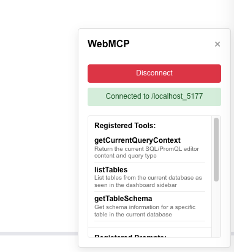

# WebMCP in GreptimeDB Dashboard

This page explains how to connect an MCP client (OpenCode / Claude Desktop / etc.) to the GreptimeDB Dashboard via WebMCP.

## 1) Install / Configure WebMCP MCP Server

```json
{
  "mcpServers": {
    "webmcp": {
      "command": "npx",
      "args": [
        "-y",
        "@jason.today/webmcp@latest",
        "--mcp"
      ]
    }
}
```

## 2) Generate a token and connect in the Dashboard

1. Start your MCP client.
2. Ask it to **create a WebMCP token**.
3. Open GreptimeDB Dashboard in the browser.
4. Click the **blue WebMCP square** in the bottom-right corner.
5. Paste the token, then click **Connect**.



## Notes

- The Dashboard will register tools for GreptimeDB operations. Most workflows should prefer **SQL**; metrics workflows may use **PromQL** when appropriate.
