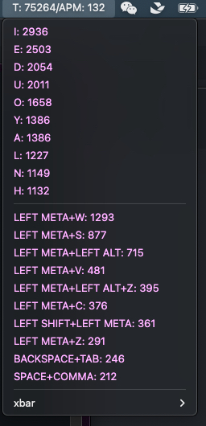
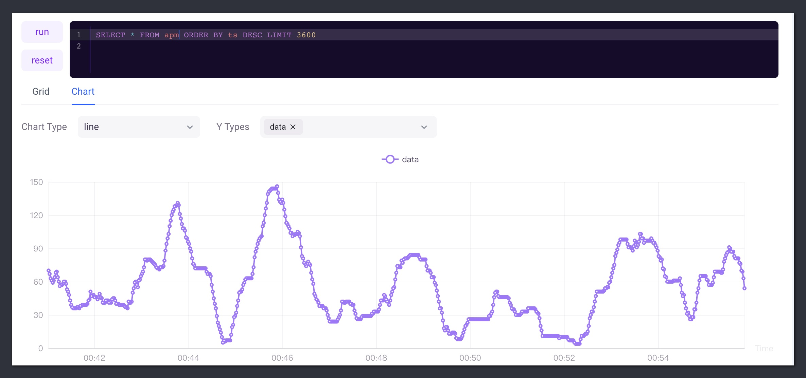

# Typing Master

这是一个实际应用的案例

首先我们可以在本地启动一个GreptimeDB

```
./greptimedb standalone start
```

创建一个表用来收集按键信息，另一个表存放APM数据。

``` sql
CREATE TABLE keymaster (
  ts TIMESTAMP TIME INDEX,  
  key STRING
)
```

``` sql
CREATE TABLE apm (
  ts TIMESTAMP TIME INDEX,  
  data INT
)
```

接下来在本地运行一段NodeJS代码读取按键信息，并且写入到数据库中

``` js
const axios = require('axios')
const qs = require('qs')
const { GlobalKeyboardListener } = require('node-global-key-listener')
const v = new GlobalKeyboardListener()
// Log every key that's pressed.
v.addListener(function (e, down) {
  if (e.state === 'DOWN') {
    let metaKey = Object.entries(down)
      .filter(([key, value]) => value === true && key.length > 1 && !/LOCK/.test(key))
      .map(([key, value]) => key)

    if (e.name.length === 1) metaKey.push(e.name)
    metaKey = metaKey.join('+')
    saveKeypressEvent(metaKey)
    console.log(`${metaKey}`)
  }
})

const saveKeypressEvent = async (metaKey) => {
  try {
    const response = await axios.post(
      '{{host}}/sql?db=public',
      qs.stringify({
        sql: `INSERT INTO keymaster(key, ts) VALUES('${metaKey}', ${new Date().valueOf()})`,
      })
    )
  } catch (error) {
    console.log(error)
  }
}
```

注意，这个脚本需要常驻内存中，对按键进行实时监听。

---

日常中，我使用 [xbar](https://xbarapp.com/) 运行了一个定时脚本

```js
#!/usr/bin/env /usr/local/bin/node

const axios = require('axios')
const qs = require('qs')

const getSQLResult = async (select, where) => {
  try {
    const res = await axios.post(
      '{{host}}/sql?db=public',
      qs.stringify({
        sql: `select ${select.join()} as times from keymaster` + (where ? ` WHERE ${where}` : ''),
      })
    )
    return res.data.output[0].records
  } catch (error) {}
}

const setAPM = async (apm) => {
  try {
    const res = await axios.post(
      '{{host}}/sql?db=public',
      qs.stringify({
        sql: `INSERT INTO apm(data, ts) VALUES(${apm}, ${new Date().valueOf()})`,
      })
    )
    return res.data
  } catch (error) {}
}

const getLetterCounts = async () => {
  const res = await getSQLResult(['key', 'COUNT(*)'], `LENGTH(key) < 2 Group by key order by times DESC limit 10`)
  return res.rows
}
const getGroupKeyCounts = async () => {
  const res = await getSQLResult(['key', 'COUNT(*)'], `key like '%+%' Group by key order by times DESC limit 10`)
  return res.rows
}

const getTotalKeyCounts = async () => {
  const res = await getSQLResult(['COUNT(*)'])
  return res.rows[0][0]
}

const getLastMinuteKeyCounts = async () => {
  const res = await getSQLResult(['COUNT(*)'], `ts > ${new Date().valueOf() - 60000}`)
  return res.rows[0][0]
}

;(async () => {
  let letterCounts = await getLetterCounts()
  let totalKeyCount = await getTotalKeyCounts()
  let groupKeyCounts = await getGroupKeyCounts()
  let lastMinuteKeyCounts = await getLastMinuteKeyCounts()

  console.log(`T: ${totalKeyCount}/APM: ${lastMinuteKeyCounts}`)
  console.log('---')
  // console.log(`|image=${image}`)
  // console.log('---')
  letterCounts.forEach((row) => {
    console.log(`${row[0]}: ${row[1]}|color=#fff`)
  })
  console.log('---')
  groupKeyCounts.forEach((row) => {
    console.log(`${row[0]}: ${row[1]}|color=#fff`)
  })

  await setAPM(lastMinuteKeyCounts)
})()
```

配合`xbar`使用，可以在状态栏看到当前用户的输入统计



从按键频率不难看出，我是一个`vim`党，习惯使用快捷键关闭窗口，不保存难受星人，一次复制多次粘贴选手，反撤销比撤销次数还多的纠结少年。

一些统计脚本你们可以试一下，比如获取最高频输入的10个字母，可以改成其他规则，比如修改查询个数，或者不限制查询key的长度，我猜你按得最多的键是`BACKSPACE`

```sql
SELECT 
  key, 
  COUNT(*) as times 
FROM 
  keymaster 
WHERE
  LENGTH(key) < 2 
GROUP BY 
  key 
ORDER BY 
  times DESC 
LIMIT 
  10
```

如果使用了前面的定时脚本，那么下面这段SQL应该可以绘制出最近一个小时你的APM

```sql
SELECT * FROM apm2 ORDER BY ts DESC LIMIT 3600
```

这是我的结果：



以上是Playground的演示，除了显示可运行代码以外，还可以显示非可交互代码。